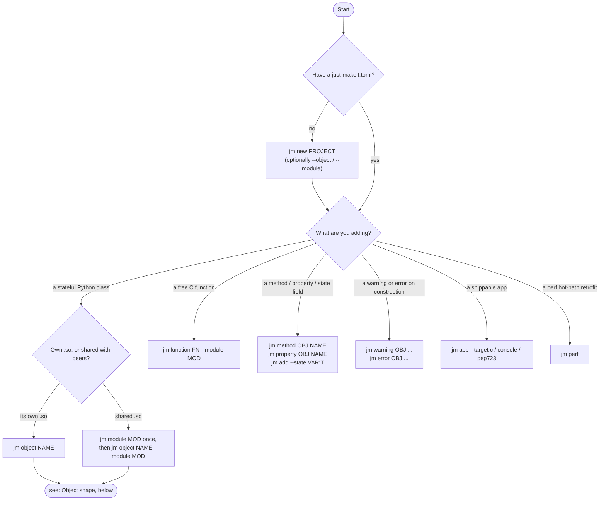
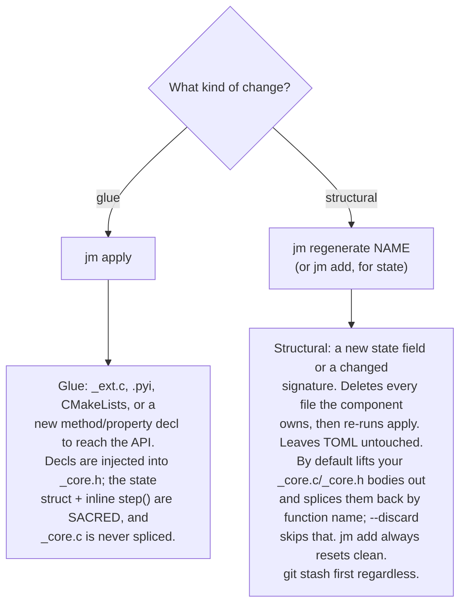

# Decision tree — which `jm` command do I want?

Use this page when you don't know which command starts the work you're about
to do. Follow the flow to the command, then jump to the relevant per-command
page for details.

______________________________________________________________________

## The flow

Already have the code and just need to **operate** on the project? Those
commands are a flat lookup, not a branch:

| I edited / want to…                           | command                             |
| --------------------------------------------- | ----------------------------------- |
| Materialize TOML edits into files (glue)      | `jm apply`                          |
| Compose an external fragment into the project | `jm apply <fragment.toml>`          |
| Rebuild a component from the manifest         | `jm regenerate <name>`              |
| Delete generated code **and** TOML wiring     | `jm remove <kind> <name>`           |
| Build / run tests / run benchmarks            | `jm build` · `jm test` · `jm bench` |
| Reconstruct the CLI history from TOML         | `jm script`                         |
| Upgrade an old project's schema               | `jm upgrade`                        |

> `jm apply` and `jm regenerate` are the two halves of the sacred/glue
> contract — see [apply vs regenerate](#apply-vs-regenerate-the-sacredglue-contract).

______________________________________________________________________

## Sub-decision A. Object shape (for `jm object`)

What does `step()` look like?

| Shape                           | Flags                                                                                                              |
| ------------------------------- | ------------------------------------------------------------------------------------------------------------------ |
| input → output (1:1, processor) | `--arg-type "float _Complex"` (default)                                                                            |
| array → 1 sample (array input)  | `--arg-type "T[]"` (`steps()` not generated)                                                                       |
| no input (generator)            | `--arg-type void` (defaults to a complex return)                                                                   |
| no output (consumer)            | `--return-type void`                                                                                               |
| no `step()` — custom verbs only | `--no-step` + `jm method …`                                                                                        |
| reader (no step, opens a file)  | `--no-step` + `--init-param filepath:"const char *"`                                                               |
| array → array (blockwise)       | `--preset blockwise` (default `float _Complex[] → float _Complex[]`; override with `--arg-type` / `--return-type`) |

What state does it carry?

| State                              | How                                                                                                |
| ---------------------------------- | -------------------------------------------------------------------------------------------------- |
| scalar defaults only               | `[[state]]` entries (default path)                                                                 |
| no internal state                  | `--no-state` + `[[init_params]]`                                                                   |
| user-facing ctor ≠ internal state  | `[[state]]` + `[[init_params]]` + `create_impl` (init_params drive the ctor, state stays internal) |
| some fields preserved on `reset()` | `state.roles = "config"` (TOML only)                                                               |

## Sub-decision B. Method output shape (for `jm method`)

| Output                             | How                                                        |
| ---------------------------------- | ---------------------------------------------------------- |
| Fixed N out for N in (resampler)   | `out_type="float"`, `out_divisor=2`                        |
| Variable count out (event emitter) | `variable_output=true` (provide `<comp>_<name>_max_out()`) |
| List of records out (events)       | `result_fields=[{name, type}, …]`                          |
| Multiple parallel buffers          | `multi_output=["float _Complex", …]`                       |
| Skip from benchmarks               | `bench=false`                                              |

## Sub-decision C. External dependencies

How is the dependency found?

| Source                         | Declaration                             |
| ------------------------------ | --------------------------------------- |
| Vendored C subdir in your tree | `[project] c_deps = ["liba", "libb"]`   |
| Findable by `find_package`     | `[project] find_packages = ["Doppler"]` |
| pkg-config available           | `[project] pkg_modules = ["doppler"]`   |

Then, on the module or component that uses it:

| Need                | Declaration                                       |
| ------------------- | ------------------------------------------------- |
| Link against a lib  | `extra_link_libs = ["${DOPPLER_LIBRARY}"]`        |
| Include its headers | `extra_include_dirs = ["${DOPPLER_INCLUDE_DIR}"]` |

## Sub-decision D. Preset (for `jm object --preset NAME`)

| `step()` shape             | Preset                                  |
| -------------------------- | --------------------------------------- |
| input → output (1:1)       | `processor` (default)                   |
| no input, produces samples | `generator` (void arg → complex return) |
| consumes input, no output  | `consumer`                              |
| no `step()`, custom verbs  | `reader`                                |
| array in → array out       | `blockwise`                             |

______________________________________________________________________

## `apply` vs `regenerate` (the sacred/glue contract)

You edited `just-makeit.toml` by hand. Which command propagates the change?

**Rule of thumb:** `apply` is the safe, additive refresh (glue + missing
declarations). `regenerate` is the deliberate rebuild — use it when a signature
change or a new state field must re-stub the sacred `_core.c` body; it
preserves what it can by default. `jm add` is `regenerate` specialised for
adding state, always with a clean (`--discard`) reset.

______________________________________________________________________

## "I want…" lookup

| I want…                                  | do…                                                     |
| ---------------------------------------- | ------------------------------------------------------- |
| A new project                            | `jm new <name>`                                         |
| A class with state, own .so              | `jm object <name>`                                      |
| Multiple classes in one .so              | `jm module <mod>`, then `jm object … --module <mod>`    |
| A free C function in a module            | `jm function <fn> --module <mod>`                       |
| A second `.execute_*()` method           | `jm method <obj> <method>`                              |
| Read-only Python property                | `jm property <obj> <prop>`                              |
| Read-write Python property               | `jm property <obj> <prop> --writable`                   |
| Aliased property (existing field)        | `jm property <obj> <prop> --field` (same name as state) |
| Add a state field later                  | `jm add --state <var>:T:V [--object <obj>]`             |
| Warn after construction                  | `jm warning <obj> --condition F --message "…"`          |
| Map a `create()` failure to an exception | `jm error <obj> --category ValueError --message "…"`    |
| SIMD batch dispatch / `JM_HOT`           | scaffold with `--perf`, or `jm perf` later              |
| Standalone C executable                  | `jm app --target c`                                     |
| Python CLI from your obj                 | `jm app --target console`                               |
| PEP 723 single-file script               | `jm app --target pep723`                                |
| Drop generated files **and** TOML        | `jm remove <kind> <name>`                               |
| Materialize TOML changes (glue)          | `jm apply`                                              |
| Compose a fragment file                  | `jm apply <fragment.toml>`                              |
| Refresh a component, keep TOML           | `jm regenerate <name>`                                  |
| Run benchmarks                           | `jm bench`                                              |
| Reconstruct the CLI history              | `jm script`                                             |
| Upgrade an old project                   | `jm upgrade`                                            |

______________________________________________________________________

## When the CLI can't reach it (TOML-only features)

Every common TOML knob has a CLI flag; see the field-by-field inventory at
[Configuration → Complete CLI ↔ TOML mapping](configuration.md#complete-cli-toml-mapping)
for the authoritative status of every key.

Remaining TOML-only by design (a small tail of use cases):

- `opaque` state fields, `no_ctor` per-field, `roles = "config"`
- `init_params` modifiers: `default_raw`, `real_type`, `real_create_fn`, `create_fn`
- `init_post_parse_impl`, `string_enum:` init-param types
- `buf_field` / `len_field` / `valid_field` / `expr` property variants
- `max_results` / `max_results_param` on methods/functions
- `no_generate` modules (hand-written from scratch)
- `extra_c` files
- Per-component `extra_link_libs` (per-module is reachable via CLI)

See [Configuration](configuration.md) for the full schema.
