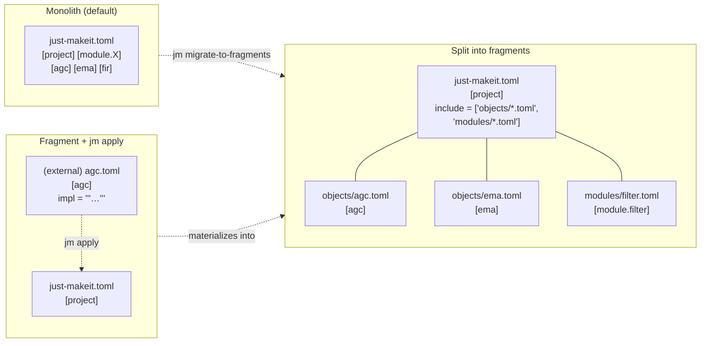
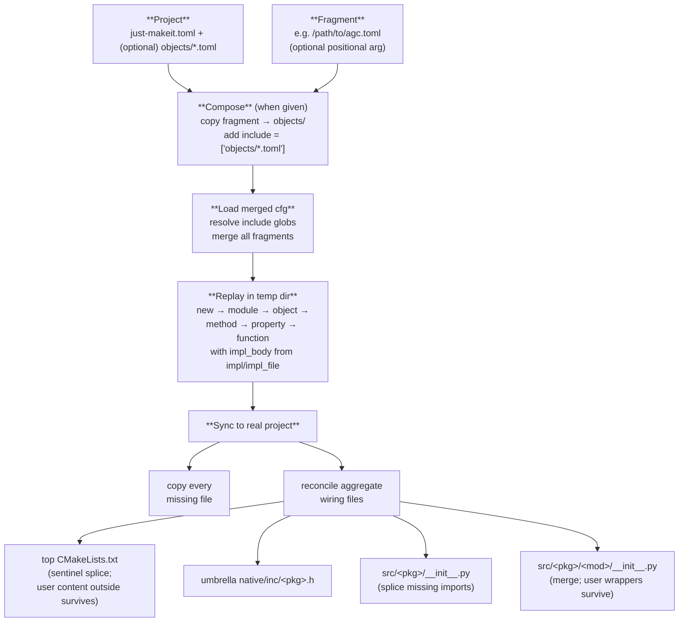
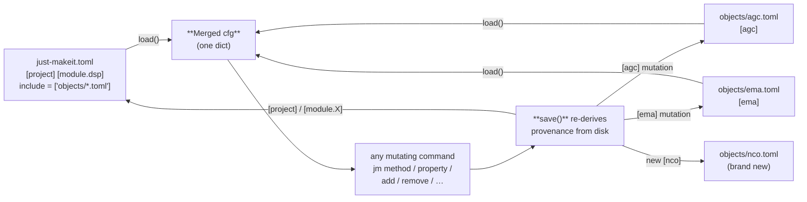

# Declarative scaffolding

Author your project as a TOML, `jm apply` it into a buildable extension —
or split an existing single-file manifest into one fragment per component
and let mutations land back in the right file. This page walks the whole
workflow end to end.

> Schema 6, available since v0.13.5. The design doc lives at
> [developers/declarative-scaffolding.md](developers/declarative-scaffolding.md).
> A runnable end-to-end demo is bundled as `just-makeit example declarative_scaffold`.

> **New to just-makeit?** Install it first — see the
> [Quickstart on the home page](index.md#quickstart) for the one-liner.

______________________________________________________________________

## TL;DR

> Reminder: [install just-makeit](index.md#quickstart) if you haven't already.

```sh
just-makeit new demo                      # bare project
just-makeit apply path/to/agc.toml        # one TOML, including the C body
cd demo && cmake -B build && cmake --build build
ctest --test-dir build                    # green
```

The `agc.toml` fragment carries the whole component — type, state, and
the `step()` body inline. `jm apply` copies it into `objects/`, registers
it via `include = ["objects/*.toml"]`, materializes every file the spec
implies, and wires it into the top `CMakeLists.txt`, the package
`__init__.py`, and the umbrella header. From there it builds.

______________________________________________________________________

## Three layouts

A just-makeit project can live in any of three shapes; they're
interchangeable and the CLI never cares which one you're on.



| Layout               | Best when…                                                                                 |
| -------------------- | ------------------------------------------------------------------------------------------ |
| **Monolith**         | small project, single author, everything fits on a page                                    |
| **Split**            | many components, multi-author / multi-machine, less merge churn                            |
| **Fragment + apply** | composing a new project from a manifest you (or a generator) wrote elsewhere; CI templates |

`jm migrate-to-fragments` migrates Monolith → Split in one command — every
`[obj]` moves to `objects/<name>.toml` and every `[module.X]` to
`modules/<name>.toml`. (`jm split-objects` is the objects-only subset, kept
for projects that want modules to stay inline.) `jm new` seeds a fresh project
on the Split layout by default; pass `--no-fragments` to use the legacy
single-manifest layout. `jm apply <fragment>` composes a Fragment into either
layout.

______________________________________________________________________

## The fragment

A fragment file holds one or more top-level object sections. It can carry
the C `step()` body inline via `impl` (a TOML heredoc), and unknown
`{placeholder}` substitutions are left alone so literal C braces pass
through untouched:

```toml
# objects/agc.toml
[agc]
arg_type    = "float _Complex"
return_type = "float _Complex"
mutable     = "true"

impl = """
/* {Component} — EMA power tracker + gain pass-through. */
const float mag2 = crealf(x) * crealf(x) + cimagf(x) * cimagf(x);
state->power = state->power + state->alpha * (mag2 - state->power);
return (float _Complex)(state->gain * x);
"""

[[agc.state]]
name = "alpha"
type = "float"
default = "0.05f"

[[agc.state]]
name = "power"
type = "float"
default = "0.0f"

[[agc.state]]
name = "gain"
type = "float"
default = "1.0f"
```

Known placeholders:

| Placeholder                    | Substituted with                                          |
| ------------------------------ | --------------------------------------------------------- |
| `{component}`                  | lowercase object name (`agc`)                             |
| `{Component}`                  | title-cased class name (`Agc`)                            |
| `{module}` / `{Module}`        | module name / title-cased                                 |
| `{arg_type}` / `{return_type}` | step argument and return types                            |
| `{method}`                     | method name (only on `[[X.methods]]` sections)            |
| `{function}`                   | function name (only on `[[module.X.functions]]` sections) |

Two more keys are honoured on object and method sections:

- `impl_file = "path::funcname"` — lift a named function's body from an
    existing C file (same `--impl` semantics as the CLI; relative to the
    project root).
- `impl_file = "path::N:M"` — lift lines `N..M` (inclusive, 1-based) from a
    file instead of a named function. Out-of-bounds or inverted ranges error
    cleanly before any side effects.
- `replace = { "old" = "new" }` — string substitutions applied *after*
    placeholder interpolation.

`impl` and `impl_file` are mutually exclusive; apply errors before any
side effects if both are set.

### Custom `create()` and `reset()` bodies

When the generated field-assignment code is not enough — parameter
validation, lookup tables, computed masks — add `create_impl` and/or
`reset_impl` to the object section:

```toml
[lfsr]
arg_type    = "void"
return_type = "uint8_t"
mutable     = "true"
no_step     = "true"    # suppress default step/steps when using custom methods
create_impl = """
if (initial_state == 0) return NULL;
obj->initial_state = initial_state;
obj->state         = initial_state;
obj->mask          = (length == 64) ? ~0ULL : ((1ULL << length) - 1);
"""
reset_impl = """
state->state = state->initial_state;
"""

[[lfsr.state]]
name = "initial_state"
type = "uint64_t"
default = "0"
...
```

!!! warning "TOML ordering: keys before sub-table arrays"

    All scalar keys (`impl`, `create_impl`, `reset_impl`, `arg_type`, …)
    **must appear before** any `[[comp.state]]` (or `[[comp.methods]]`)
    entries in the same section. TOML requires this: once an array-of-tables
    header appears, all subsequent bare keys are parsed as part of that entry,
    not the parent section.

    **Correct** — keys first, state arrays after:

    ```toml
    [lfsr]
    arg_type    = "void"
    create_impl = """…"""

    [[lfsr.state]]
    name = "initial_state"
    ...
    ```

    **Wrong** — key after array-of-tables header (silently dropped):

    ```toml
    [lfsr]
    arg_type = "void"

    [[lfsr.state]]
    name = "initial_state"
    ...

    create_impl = """…"""   # ← parsed into the last [[lfsr.state]] entry, not [lfsr]!
    ```

!!! note "`obj` vs `state` in `create_impl`"

    Inside a `create_impl` body the freshly `calloc`'d struct pointer is
    named **`obj`** (not `state`). This avoids a C compiler redeclaration
    error when a state field happens to be named `state`:

    ```c
    /* create_impl sees: */
    lfsr_state_t *obj = calloc(1, sizeof(*obj));
    /* parameters are state field names, e.g. uint64_t initial_state */
    ```

    Inside a `reset_impl` body the pointer is the function parameter
    **`state`** (as in every other C function that takes a
    `<comp>_state_t *state`).

File-reference variants are also supported:

```toml
create_impl_file = "legacy/lfsr_core.c::lfsr_create"
reset_impl_file  = "legacy/lfsr_core.c::lfsr_reset"
```

`create_impl` / `create_impl_file` are mutually exclusive, as are
`reset_impl` / `reset_impl_file`.

### Custom `destroy()` body — `destroy_impl`

Objects that allocate auxiliary resources in `create_impl` (heap buffers,
file handles, child objects) need matching teardown. `destroy_impl` splices
a body into `comp_destroy()` **before** the trailing `free(state)` that
releases the struct itself:

```toml
[buf]
arg_type      = "void"
return_type   = "void"
mutable       = "true"
destroy_impl  = """
if (state->log) fclose(state->log);
free(state->scratch);
"""

[[buf.state]]
name = "n"
type = "uint32_t"
default = "0"
```

…generates:

```c
void
buf_destroy(buf_state_t *state)
{
    if (state->log) fclose(state->log);
    free(state->scratch);
    free(state);
}
```

Use `state->field` (the function parameter is named `state`). Do **not**
write `free(state)` yourself — it is appended automatically.

`destroy_impl` / `destroy_impl_file` are mutually exclusive. The same TOML
ordering rule applies: place the scalar key **before** any `[[buf.state]]`
arrays.

### Opaque state fields — pointers and handles

Heap buffers, file handles, FFTW plans, and other resources whose C type
isn't a numeric scalar are declared with `opaque = true` on a
`[[<comp>.state]]` entry. The field is emitted into the state struct
verbatim with **no** auto-generated getter/setter, **no** constructor
parameter, **no** kwlist entry, and **no** reset assignment — Python sees
nothing of it. Lifecycle is entirely yours via `create_impl` (mandatory)
and `destroy_impl` (strongly recommended).

```toml
[fft]
arg_type     = "void"
return_type  = "void"
no_state     = "true"           # no scalar state, only opaque fields
create_impl  = """
obj->n = 1024;
obj->scratch = fftwf_malloc(sizeof(float _Complex) * obj->n);
if (!obj->scratch) { free(obj); return NULL; }
obj->plan = fftwf_plan_dft_1d(obj->n, obj->scratch, obj->scratch,
                              FFTW_FORWARD, FFTW_ESTIMATE);
"""
destroy_impl = """
if (state->plan) fftwf_destroy_plan(state->plan);
fftwf_free(state->scratch);
"""

[[fft.state]]
name   = "scratch"
type   = "float _Complex *"
opaque = true

[[fft.state]]
name   = "plan"
type   = "fftwf_plan"
opaque = true
```

Generates a struct like:

```c
typedef struct {
    float _Complex *scratch;
    fftwf_plan      plan;
} fft_state_t;
```

…and a constructor + destructor that run your `create_impl` / `destroy_impl`
bodies verbatim.

!!! warning "Opaque fields require `create_impl`"

    `jm apply` refuses to materialize a fragment that declares any opaque
    state field without a matching `create_impl` or `create_impl_file` —
    the auto-generated `create()` would leave the pointer uninitialized,
    and the first read would dereference garbage. Pair every opaque field
    with a `create_impl` that initializes it, and a `destroy_impl` that
    releases it (the validator does not enforce `destroy_impl` because
    some opaque fields are borrowed and shouldn't be freed, but most
    should be).

Opaque fields are TOML-only — there is no `--state name:opaque:type` CLI
syntax. The type string can be anything the compiler accepts (raw
pointers, typedef'd handles, function-pointer typedefs); the just-makeit
type system doesn't inspect it.

See the **opaque_counter** and **delay_line** bundled examples for
minimal and realistic patterns:

```sh
just-makeit example opaque_counter   # dead-simple: heap-allocated counter
just-makeit example delay_line       # complex: circular delay with runtime length
```

#### Pitfalls and idioms

Opaque fields put the user in charge of ownership. The five footguns
below come up most often when teaching this feature; each is paired
with the idiom that avoids it.

!!! danger "Don't reach for opaque when a fixed-length array works"

    If the buffer size is a compile-time constant, declare it as
    `type = "float[N]"` instead. Fixed-length arrays live **inside**
    the state struct — one `calloc` covers everything, no separate
    `free`, no lifetime to manage, no validator constraints. Opaque
    is for storage whose size or type isn't known until construction.

    === "Wrong — heap-alloc'd for no reason"

        ```toml
        create_impl  = "obj->taps = calloc(16, sizeof(float));"
        destroy_impl = "free(state->taps);"

        [[delay.state]]
        name   = "taps"
        type   = "float *"
        opaque = true
        ```

    === "Right — fixed array, zero machinery"

        ```toml
        [[delay.state]]
        name = "taps"
        type = "float[16]"
        ```

!!! warning "Always pair `create_impl` with `destroy_impl` for owned pointers"

    The validator enforces `create_impl` (otherwise the pointer is
    uninitialized garbage), but it does **not** enforce `destroy_impl`
    — because some opaque fields are *borrowed* and must not be freed.
    For every opaque field you `malloc`/`calloc`/`fftw_malloc`/`open`/
    etc., add the matching teardown.

    === "Wrong — leaks every instance"

        ```toml
        create_impl = """
        obj->scratch = malloc(1024 * sizeof(float));
        """
        # no destroy_impl — buffer leaks at destroy time
        ```

    === "Right — paired lifetime"

        ```toml
        create_impl  = """
        obj->scratch = malloc(1024 * sizeof(float));
        if (!obj->scratch) { free(obj); return NULL; }
        """
        destroy_impl = "free(state->scratch);"
        ```

!!! warning "Unwind partial allocations on `create_impl` failure"

    `comp_destroy()` is **not** called when `comp_create()` returns
    NULL, so any successful allocations made before a later failure
    must be freed inside `create_impl` itself. The pattern is
    "alloc — check — alloc — check, freeing all prior on each
    failure path."

    === "Wrong — `scratch` leaks if `plan` fails"

        ```c
        obj->scratch = malloc(N * sizeof(float));
        if (!obj->scratch) { free(obj); return NULL; }
        obj->plan = fftwf_plan_dft_1d(N, ...);
        if (!obj->plan) { free(obj); return NULL; }  /* leaks scratch! */
        ```

    === "Right — unwind in reverse order"

        ```c
        obj->scratch = malloc(N * sizeof(float));
        if (!obj->scratch) { free(obj); return NULL; }
        obj->plan = fftwf_plan_dft_1d(N, ...);
        if (!obj->plan) {
            free(obj->scratch);
            free(obj);
            return NULL;
        }
        ```

!!! tip "Borrowed pointers: opaque without `destroy_impl` is correct"

    When the opaque field stores a pointer that **another object
    owns** — a shared lookup table, a parent context, a const
    function pointer — `destroy_impl` must **not** free it. Declare
    the opaque field, set it in `create_impl`, and leave teardown
    alone. Document the ownership in a TOML comment so the next
    reader knows it's deliberate.

    ```toml
    create_impl  = """
    obj->lut = lut;   /* borrowed — caller retains ownership */
    """
    # no destroy_impl — we don't own `lut`

    [[fir.state]]
    name   = "lut"
    type   = "const float *"
    opaque = true
    ```

!!! warning "Scalar setters don't realloc opaque buffers"

    A scalar field like `length` gets an auto-generated
    `comp_set_length()` that just writes to the struct. If the
    opaque buffer was sized using that scalar, calling
    `set_length(N_NEW)` will **not** resize the buffer — subsequent
    reads/writes overflow or under-utilize. If the field genuinely
    needs to resize at runtime, expose a custom method that
    `realloc`s the buffer and updates the scalar atomically; if it
    doesn't, treat the field as construction-only and don't expose a
    setter at all (use `reset_impl` to preserve it across `reset()`,
    as in the `delay_line` example).

    === "Wrong — set_length() leaves taps the old size"

        ```python
        obj = DelayLine(length=16)   # taps is 16 floats
        obj.set_length(64)           # taps is STILL 16 floats — UB on access
        ```

    === "Right — resize is an explicit method"

        ```toml
        [[delay.methods]]
        name        = "resize"
        arg_type    = "uint32_t"
        return_type = "void"
        impl        = """
        float *new_taps = realloc(state->taps, n * sizeof(float));
        if (!new_taps) return;  /* keep old buffer on failure */
        if (n > state->length) {
            memset(new_taps + state->length, 0,
                   (n - state->length) * sizeof(float));
        }
        state->taps   = new_taps;
        state->length = n;
        state->idx    = state->idx % n;
        """
        ```

______________________________________________________________________

## Integrating hand-written C libraries (`c_deps`, `no_generate`, `depends_on`)

These three keys are for projects that mix just-makeit-managed objects with
existing C code that you wrote by hand or pulled in as a submodule.

### `c_deps` — pure-C dependency subdirectories

```toml
[project]
c_deps = ["resamp", "fft"]
```

`jm apply` emits an `add_subdirectory(native/src/<dep>)` block for each
entry, **prepended before all component and module blocks** so that CMake
sees the target definitions before any `target_sources(… TARGET_OBJECTS:<dep>_core)` that references them.

No Python scaffolding is generated for `c_deps` entries — they are C-only
libraries. Create their `CMakeLists.txt` by hand; `jm apply` only wires
them into the root CMake file.

### `no_generate` — hand-written modules

```toml
[module.hand_rolled]
no_generate = "true"
```

`jm apply` emits `add_subdirectory(native/src/hand_rolled)` in the root
`CMakeLists.txt` but skips every scaffolding step — no `_ext.c`, no Python
test, no type stub, no `__init__.py` entry. Use this when the module's
Python binding is hand-written and must not be touched by the generator.

### `depends_on` — transitive OBJECT library dependencies

```toml
[fir]
depends_on = ["resamp", "fft"]
```

When `jm object fir --depends-on resamp --depends-on fft` (or `jm apply`)
creates the CMake entry for `fir`, it prepends:

```cmake
target_sources(<pkg>_lib PRIVATE $<TARGET_OBJECTS:resamp_core>)
target_sources(<pkg>_lib PRIVATE $<TARGET_OBJECTS:fft_core>)
target_sources(<pkg>_lib PRIVATE $<TARGET_OBJECTS:fir_core>)
```

This ensures that `fir`'s Python extension links the transitive C objects
it needs, without requiring a separate shared library per dependency.

### Full example

```toml
[project]
name = "my_dsp"
c_deps = ["resamp"]          # hand-written C; add_subdirectory only

[module.legacy]
no_generate = "true"          # existing Python binding; don't touch

[fir]
arg_type   = "float _Complex"
depends_on = ["resamp"]       # fir.so also links resamp_core objects
```

```sh
jm apply    # wires all three into CMakeLists.txt; skips legacy scaffolding
make && make test
```

______________________________________________________________________

## What `jm apply` does



### The sacred/glue contract

`apply` is the half of the contract that **reconciles the manifest with
the tree**. Each file the manifest describes falls into one of three
classes:

| File                                                           | Class      | On re-apply                                                                                                                                   |
| -------------------------------------------------------------- | ---------- | --------------------------------------------------------------------------------------------------------------------------------------------- |
| `<comp>_ext.c`, `src/<pkg>/<comp>.pyi`, every `CMakeLists.txt` | **glue**   | regenerated from the manifest every time                                                                                                      |
| `<comp>_core.h`                                                | **mixed**  | a TOML-declared method/property **declaration** is injected; the inline `step()` body and the state struct are **sacred** — never re-rendered |
| `<comp>_core.c`                                                | **sacred** | never spliced or re-rendered once it exists — `steps()` and lifecycle bodies are yours                                                        |

So editing the manifest always propagates to the glue, and `apply` injects any
missing method/property declaration into `_core.h`. But the struct and inline
`step()` stay sacred. If you change a **signature** in TOML or add a **state
field**, that's *structural* — the glue and declarations update on `apply`, but
the sacred `_core.c` body is left as you wrote it. Rebuild it from the manifest
with `jm regenerate` (or `jm add`, which is `regenerate` specialized for state).
A new method or computed property is additive instead: `jm method` /
`jm property` inject a declaration and append a fresh stub.

Other properties:

- **Idempotent.** Re-running on a complete project is a no-op.
- **Reproducible.** A `just-makeit.toml` + any hand-written `*_core.c` body
    fully describe a project; `apply` materializes the rest.
- **Never deletes.** `apply` only adds or refreshes files; removing a
    component is `jm remove`'s job, and wiping a component back to its
    manifest state is `jm regenerate`'s.
- **Aggregate safety.** The top `CMakeLists.txt` preserves content outside
    the `# ── Components` and `# ── Modules` sentinel regions; module
    `__init__.py` keeps any wrapper classes you added below the re-exports.
- **Bench retrofit.** `apply` also appends a missing `bench_<comp>_core`
    CMake target to any component's `CMakeLists.txt` — existing projects gain
    C benchmark targets without a manual edit.

### `--only=NAME` — single-component reconciliation

```sh
jm apply --only=fir
```

Restricts wiring regeneration to the named component: only `fir`'s
`_ext.c`, `CMakeLists.txt`, `.pyi`, and test file are touched. All
aggregate files (`__init__.py`, root `CMakeLists.txt`, umbrella header)
are still updated. Useful on large projects where a full re-apply is slow.

______________________________________________________________________

## `jm regenerate <component>` — the deliberate refresh

`apply` preserves the sacred `_core.c` body, which is exactly what you want
99% of the time. When you instead want a component rebuilt cleanly from its
manifest — after a sweeping signature change, or to discard an experiment —
`jm regenerate` is the other half of the contract:

```sh
jm regenerate fir
```

It deletes every file the component owns and re-runs `jm apply` to rebuild
them from the manifest. The `just-makeit.toml` is left **untouched** (unlike
`jm remove`, which also strips the component from the manifest). Works for
both standalone and module objects.

A single confirmation guards the destructive step; `--force` skips it:

```sh
jm regenerate fir --force
```

!!! warning "Regenerate discards hand-written `_core.c` bodies"

    Because the sacred file is deleted and re-stubbed, any `steps()` /
    lifecycle code you wrote is lost. `git stash` (or commit) first if you
    might want it back.

______________________________________________________________________

## Load and save — provenance routing

`load()` merges the manifest with every included fragment into one dict
that every consumer already expects. `save()` re-derives provenance from
disk and routes each section back to the file that owns it:



Properties:

- `[project]` and `[module.X]` declarations **always** live in the
    manifest.
- A mutation to `[agc]` rewrites `objects/agc.toml` — the manifest and
    sibling fragments are **byte-for-byte unchanged**.
- A new object on a split-layout project gets a brand-new
    `objects/<name>.toml`.
- An emptied fragment (`jm remove` of its last section) is deleted.

Single-file projects (no `include` key) are unaffected: `save()` writes
the whole cfg back to the manifest exactly as before.

______________________________________________________________________

## Migrating an existing project

> Reminder: [install just-makeit](index.md#quickstart) if you haven't already.

```sh
just-makeit migrate-to-fragments
```

That's it. Every `[obj]` section moves out of `just-makeit.toml` into
`objects/<obj>.toml` and every `[module.X]` into `modules/<name>.toml`;
`[project]` stays; the manifest gains
`include = ["objects/*.toml", "modules/*.toml"]`. The merged cfg every
just-makeit consumer sees is **byte-identical** before and after. Idempotent
— running on an already-migrated project is a no-op. Mutations afterwards
(`jm add`, `jm method`, …) save back into the owning fragment, not the
manifest.

> `jm split-objects` is the objects-only subset — it leaves `[module.X]`
> sections inline in the manifest. Prefer `migrate-to-fragments` unless you
> specifically want modules to stay put. New projects use this layout by
> default; pass `--no-fragments` to use the legacy single-manifest layout
> instead.

______________________________________________________________________

## See it work

> Reminder: [install just-makeit](index.md#quickstart) if you haven't already.

```sh
just-makeit example declarative_scaffold
# declarative_scaffold: PASSED
```

The bundled example authors a complete AGC component (states, types,
inline `step()` body with `{Component}` interpolation) in one fragment,
runs `jm apply`, builds + ctests the result, and round-trips a separate
legacy project through `split-objects`. The `agc*.so` assertion at the
end means a silently-skipped target would fail loudly, not pass green.

______________________________________________________________________

## See also

- [developers/declarative-scaffolding.md](developers/declarative-scaffolding.md) — the design doc behind this feature
- [`jm apply`, `jm regenerate`, and `jm remove` reference](commands/extend.md)
- [Workflow](workflow.md) — the imperative CLI flow these commands sit alongside
