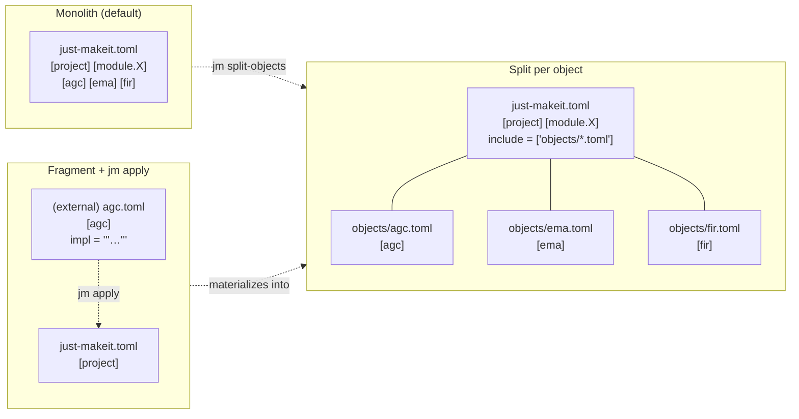
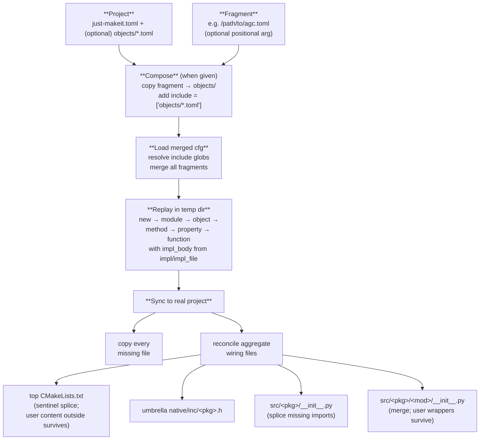
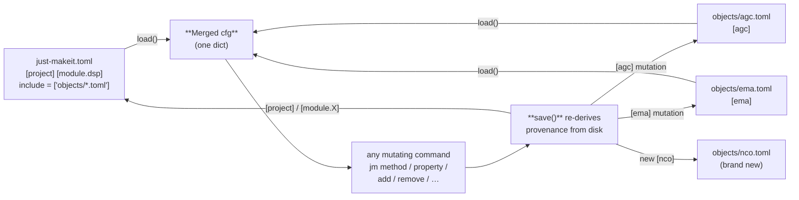

# Declarative scaffolding

Author your project as a TOML, `jm apply` it into a buildable extension —
or split an existing single-file manifest into one fragment per component
and let mutations land back in the right file. This page walks the whole
workflow end to end.

> Schema 6, available since v0.13.5. The design doc lives at
> [developers/declarative-scaffolding.md](developers/declarative-scaffolding.md).
> A runnable end-to-end demo is bundled as `just-makeit example
> declarative_scaffold`.

> **New to just-makeit?** Install it first — see the
> [Quickstart on the home page](index.md#quickstart) for the one-liner.

---

## TL;DR

> Reminder: [install just-makeit](index.md#quickstart) if you haven't already.

```sh
just-makeit new demo                      # bare project
just-makeit apply path/to/agc.toml        # one TOML, including the C body
cd demo && cmake -B build && cmake --build build
ctest --test-dir build                    # green
```

The `agc.toml` fragment carries the whole component — type, state, and
the `step()` body inline. `jm apply` copies it into `objects/`, registers
it via `include = ["objects/*.toml"]`, materializes every file the spec
implies, and wires it into the top `CMakeLists.txt`, the package
`__init__.py`, and the umbrella header. From there it builds.

---

## Three layouts

A just-makeit project can live in any of three shapes; they're
interchangeable and the CLI never cares which one you're on.



| Layout | Best when… |
|---|---|
| **Monolith** | small project, single author, everything fits on a page |
| **Split** | many components, multi-author / multi-machine, less merge churn |
| **Fragment + apply** | composing a new project from a manifest you (or a generator) wrote elsewhere; CI templates |

`jm split-objects` migrates Monolith → Split in one command; `jm apply
<fragment>` composes a Fragment into either layout.

---

## The fragment

A fragment file holds one or more top-level object sections. It can carry
the C `step()` body inline via `impl` (a TOML heredoc), and unknown
`{placeholder}` substitutions are left alone so literal C braces pass
through untouched:

```toml
# objects/agc.toml
[agc]
arg_type    = "float _Complex"
return_type = "float _Complex"
mutable     = "true"

impl = """
/* {Component} — EMA power tracker + gain pass-through. */
const float mag2 = crealf(x) * crealf(x) + cimagf(x) * cimagf(x);
state->power = state->power + state->alpha * (mag2 - state->power);
return (float _Complex)(state->gain * x);
"""

[[agc.state]]
name = "alpha"
type = "float"
default = "0.05f"

[[agc.state]]
name = "power"
type = "float"
default = "0.0f"

[[agc.state]]
name = "gain"
type = "float"
default = "1.0f"
```

Known placeholders:

| Placeholder | Substituted with |
|---|---|
| `{component}` | lowercase object name (`agc`) |
| `{Component}` | title-cased class name (`Agc`) |
| `{module}` / `{Module}` | module name / title-cased |
| `{arg_type}` / `{return_type}` | step argument and return types |
| `{method}` | method name (only on `[[X.methods]]` sections) |
| `{function}` | function name (only on `[[module.X.functions]]` sections) |

Two more keys are honoured on object and method sections:

- `impl_file = "path::funcname"` — lift the body from an existing C file
  (same `--impl` semantics as the CLI; relative to the project root).
- `replace = { "old" = "new" }` — string substitutions applied *after*
  placeholder interpolation.

`impl` and `impl_file` are mutually exclusive; apply errors before any
side effects if both are set.

---

## What `jm apply` does



Key properties:

- **Add only.** `apply` never deletes anything — removing a component is
  `jm remove`'s job.
- **Idempotent.** Re-running on a complete project is a no-op.
- **Reproducible.** A `just-makeit.toml` + any hand-written `*_core.c` /
  `*_core.h` bodies fully describe a project; `apply` materializes the
  rest.
- **Safe with user edits.** `*_core.c` and `*_core.h` bodies survive
  re-apply; the top `CMakeLists.txt` preserves content outside the
  `# ── Components` and `# ── Modules` sentinel regions; module
  `__init__.py` keeps any wrapper classes you added below the
  re-exports.

---

## Load and save — provenance routing

`load()` merges the manifest with every included fragment into one dict
that every consumer already expects. `save()` re-derives provenance from
disk and routes each section back to the file that owns it:



Properties:

- `[project]` and `[module.X]` declarations **always** live in the
  manifest.
- A mutation to `[agc]` rewrites `objects/agc.toml` — the manifest and
  sibling fragments are **byte-for-byte unchanged**.
- A new object on a split-layout project gets a brand-new
  `objects/<name>.toml`.
- An emptied fragment (`jm remove` of its last section) is deleted.

Single-file projects (no `include` key) are unaffected: `save()` writes
the whole cfg back to the manifest exactly as before.

---

## Migrating an existing project

> Reminder: [install just-makeit](index.md#quickstart) if you haven't already.

```sh
just-makeit split-objects
```

That's it. Every `[obj]` section moves out of `just-makeit.toml` into
`objects/<obj>.toml`; `[project]` and `[module.X]` stay; the manifest
gains `include = ["objects/*.toml"]`. The merged cfg every just-makeit
consumer sees is **byte-identical** before and after. Idempotent —
running on an already-split project is a no-op.

---

## See it work

> Reminder: [install just-makeit](index.md#quickstart) if you haven't already.

```sh
just-makeit example declarative_scaffold
# declarative_scaffold: PASSED
```

The bundled example authors a complete AGC component (states, types,
inline `step()` body with `{Component}` interpolation) in one fragment,
runs `jm apply`, builds + ctests the result, and round-trips a separate
legacy project through `split-objects`. The `agc*.so` assertion at the
end means a silently-skipped target would fail loudly, not pass green.

---

## See also

- [developers/declarative-scaffolding.md](developers/declarative-scaffolding.md) — the design doc behind this feature
- [`just-makeit apply` and `jm remove` reference](commands/extend.md)
- [Workflow](workflow.md) — the imperative CLI flow these commands sit alongside
