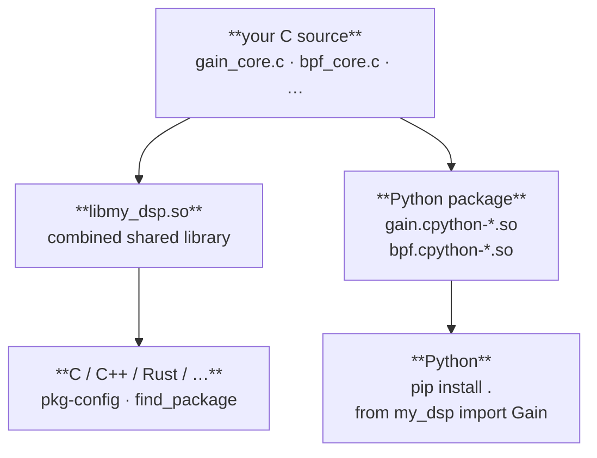

# Roadmap

## Vision

just-makeit is the fastest path from algorithm idea to production Python C extension.

Zero boilerplate. Full test coverage from day one. Just works.

The goal is simple: you should be able to think of an algorithm, run one command,
and have a complete, tested, packagable C extension project — with a clean C library
that can also be linked from Rust, C++, or anything else. The scaffolding should
disappear. Your algorithm should be all that remains.

______________________________________________________________________

## v0.2 — Performance scaffold ✓ shipped

Real algorithms are hot. The generated code should be ready for it.

**Planned and delivered:**

- `--perf` flag on `new` and `init` — generates `jm_perf.h` with
  `JM_FORCEINLINE`, `JM_HOT`, `JM_LIKELY`, `JM_UNLIKELY`, `JM_RESTRICT`,
  `JM_ALIGNED`.  All macros are C99-compatible with safe no-op fallbacks.
- `ENABLE_SIMD` CMake option — enables `-march=native -ffast-math` on
  GCC/Clang.  Off by default; opt in per build.
- `/* #pragma omp simd */` annotation on the generated `steps()` loop.

**Delivered beyond plan:**

- `just-makeit perf` command — upgrades an existing project in-place without
  touching any user-written code.  The `--perf` flag is for new scaffolds;
  `just-makeit perf` is for projects already in progress.
- `JM_DEFINE_STEPS(fn, state_t, sample_t, LENGTH, BATCH, CHUNK)` macro —
  stamps out the outer dispatch loop from three separated concerns: algorithm
  history depth, SIMD batch width, and scratch-buffer tuning.  The user writes
  `step()`.  The macro generates everything else.
- `sliding_correlator` example — proves `JM_DEFINE_STEPS` is
  algorithm-agnostic: complex cross-correlation with a different state layout
  and complex multiply uses the exact same macro invocation as the FIR filter.
- `docs/perf.md` — full reference for the macro set and `JM_DEFINE_STEPS`.

______________________________________________________________________

## v0.3 — Pure / stateless mode ✓ shipped

Not every algorithm needs state. Some are better expressed as a pure function
with no lifecycle overhead.

**Planned and delivered:**

- `--pure` flag on `new` and `init` — auto-detects style from declared params:
  - **Scalar-only params** → scalar style: params passed per call as function
    arguments; Python exports module-level `comp(x, **params)` and
    `comp.steps(arr, **params)` functions.
  - **Any array param** → struct style: caller-managed `comp_params_t` with
    `_params_create()` (calloc), `_params_free()`, `_params_init()` (for
    stack/pool/`aligned_alloc`/`mmap` allocation patterns); Python exposes a
    callable class (`obj(x)` via `tp_call`, context-manager support).
- `--param` flag — idiomatic synonym for `--state` when used with `--pure`;
  both are accepted everywhere with identical semantics.
- `pure` field in `just-makeit.toml` — persisted so `just-makeit add --param`
  regenerates the correct template set; auto-promotes scalar→struct if an
  array param is added.
- `docs/pure.md` — full cost/benefit analysis, allocation pattern guide with
  concrete C examples (heap, stack, SIMD-aligned, N-channel array, arena,
  mmap), and a Mermaid decision flowchart.

**Delivered beyond plan:**

- C and Python benchmarks generated with every component (`make bench`,
  `make bench-save`, `make bench-compare`; pytest-benchmark + doppler-style
  C binary).  Bench files are in `_STATE_TEMPLATES` so they regenerate on
  `just-makeit add`.
- `examples/` end-to-end test runner — `tests/test_examples.py`
  auto-discovers `examples/*/test.py`; `test_all_examples_have_test_py`
  enforces that every example directory ships a test driver.
- `examples/README.md` — contributor guide explaining the `.steps/` naming
  convention, `assemble.py` weaving, and the `test.py` contract.
- `examples/fir_filter` step 8 — pure FIR variant demonstrating struct-style
  caller-managed params and multi-channel usage.
- `docs/examples/` retired — stale duplicate of `examples/*/README.md`.

______________________________________________________________________

## v0.4 — C library distribution

Today just-makeit targets Python consumers. v0.4 makes the generated project
a first-class C library too — distributable to C, C++, and Rust via the
standard mechanisms, with no changes to user-written algorithm code.

**Core idea:** each component's `_core.c` compiles once (as a CMake OBJECT
library) and links into *both* the Python DSO and a combined `libmy_dsp.so`.
No duplicated object files. No diverging codebases.



**New generated artifacts:**

```text
my_dsp/
├── cmake/
│   ├── my-dsp.pc.in              # pkg-config template
│   └── my-dsp-config.cmake.in   # CMake find_package template
└── native/
    └── inc/
        └── my_dsp.h              # umbrella — includes all component headers
```

**CMake changes:**

- Each component's `CMakeLists.txt` gains an OBJECT library target
  (`gain_core` OBJECT); the Python DSO and bench binary link against
  `$<TARGET_OBJECTS:gain_core>` instead of a static archive.
- Top-level `CMakeLists.txt` accumulates all OBJECT targets into
  `libmy_dsp.so` and adds `install()` rules for the library, headers,
  pkg-config file, and CMake config package.
- `just-makeit init` patches `target_sources(${PROJECT_NAME}_lib …)` in the
  top-level alongside the existing `add_subdirectory` patch.

**Install story:**

```sh
cmake --install build --prefix /usr/local
gcc $(pkg-config --cflags --libs my-dsp) main.c -o main
```

```cmake
find_package(my-dsp REQUIRED)
target_link_libraries(my_app PRIVATE my_dsp::my_dsp)
```

______________________________________________________________________

## v0.5 — Zero-dependency wheels

Today `pip install my_dsp` requires a C compiler and CMake on the target
machine. v0.5 eliminates that.

**Static wheel mode** — just-buildit gains a `static = true` build option that
statically links the C core into each Python DSO. The resulting wheel contains
only `.cpython-*.so` files and no external `.so` dependencies.

```sh
just-makeit build --static   # → dist/my_dsp-0.1.0-cp311-cp311-linux_x86_64.whl
pip install dist/*.whl        # works anywhere — no compiler, no CMake
```

Pre-compiled wheel distribution on PyPI becomes straightforward: build once
in CI, ship everywhere.

______________________________________________________________________

## Ideas under consideration

These are not yet scheduled but are worth tracking:

- **NumPy ufunc registration** — `--ufunc` flag wraps `comp_fn` as a proper
  NumPy generalized ufunc, enabling broadcasting and `out=` support
- **Type specialisation** — generate separate `float` and `double` variants
  of a component from a single template
- **Windows / MSVC CI template** — `just-makeit new` optionally generates a
  GitHub Actions workflow with a Windows runner
- **Interactive wizard** — `just-makeit new` without arguments drops into a
  short prompt-driven setup for users who prefer guided over CLI flags
