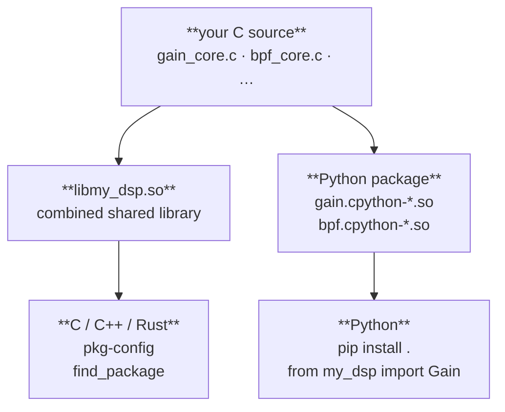

# Workflow

`just-makeit` manages the full lifecycle of a C extension project — from first
scaffold to published package.  Every project it generates is **two things at
once**: a first-class C shared library and a Python package, built from the
same source with no duplication.

---

## What you get



Each component's core logic compiles once (as an OBJECT library) and links
into both artifacts — no duplicated object files, no diverging codebases.

---

## Creating a project

```sh
just-makeit new my_dsp --component gain --state gain:double:1.0
cd my_dsp
```

`new` scaffolds the project and seeds it with a first component.  The
`--component` flag is optional — omit it and `init` the first component
separately.  `--state` works the same as everywhere else:
`name:type[:default]`.

---

## Project layout

```
my_dsp/
├── inc/                              # project-wide shared headers
│   ├── clib_common.h                 # common C99 types
│   ├── pyex_common.h                 # Python extension includes
│   └── my_dsp.h                      # umbrella — includes all component headers
├── gain/                             # component (self-contained)
│   ├── CMakeLists.txt                # OBJECT lib + Python DSO + CTest
│   ├── inc/
│   │   └── gain/
│   │       └── gain_core.h           # component API
│   ├── src/
│   │   ├── gain_core.c               # core logic — your DSP lives here
│   │   └── gain_ext.c                # thin Python binding
│   └── tests/
│       └── test_gain_core.c          # C lifecycle test
├── src/
│   └── my_dsp/                       # Python package
│       ├── __init__.py
│       ├── gain.pyi                  # type stub
│       └── tests/
│           ├── __init__.py
│           └── test_gain.py          # pytest
├── cmake/
│   ├── my-dsp.pc.in                  # pkg-config template
│   └── my-dsp-config.cmake.in        # CMake find_package template
├── CMakeLists.txt                    # project root: find_package + add_subdirectory
├── Makefile                          # convenience wrapper
├── pyproject.toml                    # PEP 517 — just-buildit backend
└── just-makeit.toml                  # project + component registry
```

---

## Building

```sh
make        # cmake configure + build (Release)
make test   # CTest + pytest
```

Produces:

| Artifact | Location |
|---|---|
| Combined C shared library | `build/libmy_dsp.so` |
| pkg-config file | `build/my-dsp.pc` |
| CMake package config | `build/my-dsp-config.cmake` |
| Python DSO (dev, no install) | `src/my_dsp/gain.cpython-*.so` |

The Python DSO lands directly in `src/my_dsp/` so `import my_dsp` works
from the source tree after a single `make` — no install step needed during
development.

---

## Implementing your DSP

Open `gain/src/gain_core.c`.  The generated stub is a pass-through — replace
`gain_step` with your logic:

```c
static inline float complex
gain_step(const gain_state_t *state, float complex x)
{
    return x * (float)state->gain;   /* <— your DSP here */
}
```

`gain_core.h` defines the full lifecycle API:

```c
gain_state_t *gain_create(double gain);
void          gain_destroy(gain_state_t *state);
void          gain_reset(gain_state_t *state);

float complex gain_step(const gain_state_t *state, float complex x);
void          gain_steps(gain_state_t *state,
                         const float complex *in,
                         float complex       *out,
                         size_t               n);

double        gain_get_gain(const gain_state_t *state);
void          gain_set_gain(gain_state_t *state, double gain);
```

The Python binding in `gain_ext.c` is generated and complete — you do not
edit it.  Add your logic to `gain_core.c` only.

---

## Adding a second component

```sh
just-makeit init bpf \
    --state center_freq:double:1000.0 \
    --state bandwidth:double:200.0    \
    --state order:int:4
```

This adds a `bpf/` directory with the same structure as `gain/`, updates
`CMakeLists.txt` with `add_subdirectory(bpf)`, registers the component in
`just-makeit.toml`, adds `bpf.pyi` and `test_bpf.py` to the Python package,
and adds `bpf_core` to the combined shared library target.

`make` picks up the new component automatically.

---

## Extending a component's state

```sh
just-makeit add --component gain --state drive:double:1.0
```

Regenerates the six state-sensitive files for `gain` from the updated state
list — all existing files are backed up first and restored if anything fails.
`just-makeit.toml` is updated only after the files are written successfully.

When the project has a single component, `--component` may be omitted.

---

## C integration

### Install

```sh
cmake --install build --prefix /usr/local
```

Installs:

```
/usr/local/
├── lib/
│   ├── libmy_dsp.so
│   ├── pkgconfig/
│   │   └── my-dsp.pc
│   └── cmake/
│       └── my-dsp/
│           ├── my-dsp-config.cmake
│           ├── my-dsp-config-version.cmake
│           └── my-dspTargets.cmake
└── include/
    ├── my_dsp.h
    ├── gain/
    │   └── gain_core.h
    └── bpf/
        └── bpf_core.h
```

### pkg-config

```sh
gcc $(pkg-config --cflags --libs my-dsp) main.c -o main
```

### CMake

```cmake
find_package(my-dsp REQUIRED)
target_link_libraries(my_app PRIVATE my_dsp::my_dsp)
```

### Usage

```c
#include "my_dsp.h"   /* umbrella — includes gain and bpf */

gain_state_t *g = gain_create(1.0);
bpf_state_t  *f = bpf_create(1000.0, 200.0, 4);

float complex y = gain_step(g, bpf_step(f, 1.0f + 0.0f * I));

gain_destroy(g);
bpf_destroy(f);
```

---

## Python integration

### Development (no install)

`make` places the DSOs directly in `src/my_dsp/`. Run Python from the project
root and the src-layout is picked up automatically:

```python
from my_dsp import Gain, BPF
```

### Install from source

```sh
pip install .
```

Uses [just-buildit](https://github.com/just-buildit/just-buildit) as the
PEP 517 build backend.  just-buildit drives the CMake build and packages the
resulting DSOs into a wheel — it works with any C extension project and does
not require just-makeit.

### Usage

```python
from my_dsp import Gain, BPF
import numpy as np

g = Gain(gain=1.0)
f = BPF(center_freq=1000.0, bandwidth=200.0, order=4)

x = np.ones(1024, dtype=np.complex64)
y = g.steps(f.steps(x))
```

---

## Packaging and release

```sh
just-makeit build          # CMake build + wheel → dist/
pip install dist/*.whl     # install the wheel
```

Or build manually:

```sh
pip wheel . -w dist/
```

The wheel contains the Python package (`src/my_dsp/`) with the compiled DSOs.
The combined C shared library (`libmy_dsp.so`) is a separate install artifact
— distribute it alongside your C headers for C/C++ consumers, or ship it as
a system package.

---

## Configuration

```sh
just-makeit config                  # show project + component registry
just-makeit config version 0.2.0    # update version
```

`just-makeit.toml` is the source of truth.  `add` and `init` update it
atomically — if generation fails, the config is left unchanged.
