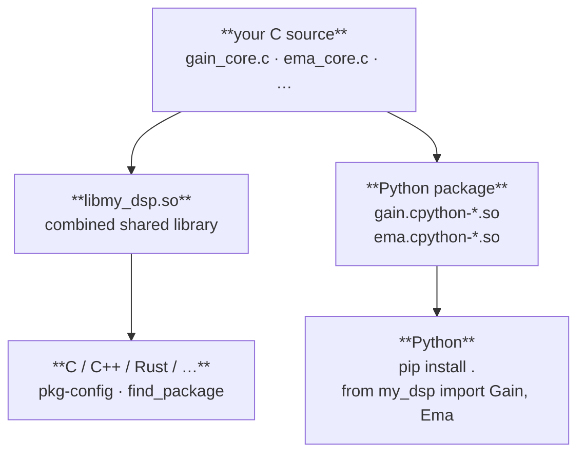

# Workflow

Three common starting points are covered below. Reference sections follow.

______________________________________________________________________

## Scenario 1 — Simple standalone extension

*You're here if:* you have one algorithm to wrap — a filter, a running
statistic, an oscillator — and you want it available as `from my_dsp import Engine` with full C and Python tests.

A single C object exposed as a Python extension. Good starting point for
wrapping an algorithm, DSP primitive, or performance-critical inner loop.

### 1. Scaffold

```sh
just-makeit new my_dsp \
    --object gain \
    --arg-type float \
    --return-type float \
    --state gain:float:1.0
cd my_dsp
```

`--arg-type` and `--return-type` set the C types for `step()`'s input and
output. Omit both and they default to `float _Complex`.

### 2. Implement

Open `native/inc/gain/gain_core.h` and fill in the `gain_step` stub:

```c
static inline float
gain_step(const gain_state_t *state, float x)
{
    return state->gain * x;
}
```

`gain_steps()` — the block processor — is already in `gain_core.c` and loops
over this automatically. You do not edit the Python binding (`gain_ext.c`).

### 3. Build and test

```sh
make        # cmake configure + build (Release)
make test   # CTest (C lifecycle) + pytest (Python API)
```

### 4. Install

```sh
pip install .          # build wheel + install
pip install -e .       # editable install (Python-only edits take effect immediately)
```

### 5. Use from Python

```python
import numpy as np
from my_dsp import Gain

g = Gain(gain=2.0)

# single sample
y = g.step(1.0)              # → 2.0

# block
x = np.ones(1024, dtype=np.float32)
y = g.steps(x)               # → float32 ndarray, all 2.0

# getters / setters
g.set_gain(0.5)
g.get_gain()                 # → 0.5

# reset to declared defaults
g.reset()

# context manager
with Gain(gain=2.0) as g:
    y = g.steps(x)
```

### 6. Optional: performance annotations

Once the algorithm is working and tested:

```sh
just-makeit perf
make
```

Patches `step()` with `JM_FORCEINLINE JM_HOT`, writes `jm_perf.h` and
`jm_simd.h`, and records the setting so future `object` and `add` calls
inherit it. See [Performance annotations](perf.md) for the full reference.

______________________________________________________________________

## Scenario 2 — Python package with multiple extensions

*You're here if:* you have several related but independent algorithms —
`Gain`, `EMA`, `Biquad` — and you want them all in one package with separate
`.so` files and full test coverage for each.

Multiple C objects in one project, all accessible from a single Python
package.

### 1. Scaffold the first object

```sh
just-makeit new dsp_toolkit \
    --object gain \
    --arg-type float \
    --return-type float \
    --state gain:float:1.0
cd dsp_toolkit && make
```

### 2. Add a second object

```sh
just-makeit object ema \
    --arg-type float \
    --return-type float \
    --state alpha:double:0.1 \
    --state prev:float:0.0
```

`object` writes all C and Python files for the new standalone object and updates:

- root `CMakeLists.txt` — `add_subdirectory` + `target_sources($<TARGET_OBJECTS:…>)`
- umbrella header `native/inc/dsp_toolkit.h` — `#include "ema/ema_core.h"`
- `src/dsp_toolkit/__init__.py` — splices in `from .ema import Ema` and
    adds `"Ema"` to `__all__`, preserving any existing user edits

After adding `ema`, `__init__.py` looks like:

```python
"""dsp_toolkit — Gain."""

from .gain import Gain
from .ema import Ema

__all__ = ["Gain", "Ema"]
```

No manual edits required.

### 3. Implement both objects

`gain_step` (read-only state):

```c
static inline float
gain_step(const gain_state_t *state, float x)
{
    return state->gain * x;
}
```

`ema_step` (writes back to state — drop `const`):

```c
static inline float
ema_step(ema_state_t *state, float x)
{
    float y = (float)state->alpha * x
            + (float)(1.0 - state->alpha) * state->prev;
    state->prev = y;
    return y;
}
```

### 4. Build and test

```sh
make && make test
```

CTest runs `test_gain_core` and `test_ema_core`. pytest runs the full
generated suite for both objects.

### 5. Install

```sh
pip install .
```

The wheel bundles all compiled DSOs (`gain.cpython-*.so`, `ema.cpython-*.so`,
…) alongside the Python package.

### 6. Use from Python

```python
import numpy as np
from dsp_toolkit import Gain, Ema

signal = np.ones(20, dtype=np.float32)

gain = Gain(gain=2.0)
ema  = Ema(alpha=0.3)

for x in signal:
    y = ema.step(gain.step(x))
```

### 7. Add more objects

```sh
just-makeit object dc_block --state r:double:0.995
```

Each `object` repeats the same pattern: new C files, updated CMake, updated
`__init__.py`. `make` picks up the new object automatically.

### 8. Install

```sh
pip install .
```

The wheel bundles the new DSO alongside all existing ones.

______________________________________________________________________

## Scenario 3 — Grouped types in a single subpackage module

*You're here if:* you're building a collection of related filter types —
`Fir`, `Biquad`, `Equalizer` — and you want `from my_filters.filter import Fir, Biquad` rather than a separate top-level import for each.

Use this when multiple related Python types should share one `.so` and import
from a common subpackage path. Each type still has its own independent C
library; the module is the Python grouping unit only.

### 1. Scaffold the project and module together

```sh
just-makeit new my_filters --module filter
cd my_filters
```

`--module` is repeatable — `--module osc --module env` scaffolds two modules
in one command. Each module is an empty slot; types are added with
`just-makeit object`.

Alternatively, scaffold the project first and add the module separately:

```sh
just-makeit new my_filters
cd my_filters
just-makeit module filter
```

### 3. Add types

```sh
just-makeit object fir \
    --module filter \
    --state "coeffs:float[16]" \
    --state "delay:float _Complex[16]" \
    --state "gain:float:1.0"

just-makeit object biquad \
    --module filter \
    --arg-type float \
    --return-type float \
    --state "b0:double:1.0" \
    --state "b1:double:0.0" \
    --state "b2:double:0.0" \
    --state "a1:double:0.0" \
    --state "a2:double:0.0" \
    --state "w1:double:0.0" \
    --state "w2:double:0.0"
```

Each `just-makeit object` call:

- Creates the C library (`_core.h`, `_core.c`, C test, C benchmark)
- Fully regenerates the module's `filter_ext.c`, `CMakeLists.txt`, and `__init__.py`

After both objects:

```python
# src/my_filters/filter/__init__.py — generated
from .filter import Fir, Biquad

__all__ = ["Fir", "Biquad"]
```

Types within a module may have different `--arg-type`/`--return-type`. Here
`Fir` processes `float complex` and `Biquad` processes `float`.

### 4. Implement

Edit `native/inc/fir/fir_core.h` and `native/inc/biquad/biquad_core.h` to
fill in the `_step` stubs, exactly as in Scenarios 1 and 2.

### 5. Build and test

```sh
make && make test
```

CMake builds one `.so` (`filter.cpython-*.so`) inside
`src/my_filters/filter/`, linking both `fir_core` and `biquad_core` OBJECT
libraries. CTest runs `test_fir_core` and `test_biquad_core`.

### 6. Install

```sh
pip install .
```

The wheel contains one `.so` for the `filter` subpackage rather than one `.so`
per type.

### 7. Use from Python

```python
import numpy as np
from my_filters.filter import Fir, Biquad

fir = Fir(gain=1.0)
bq  = Biquad(b0=1.0)
```

Both types are fully independent — separate `create`/`destroy` lifecycles,
each with its own `step`, `steps`, `reset`, and context manager support.

### 8. Add a third type later

```sh
just-makeit object iir --module filter --state "gain:float:1.0"
```

`filter_ext.c`, `CMakeLists.txt`, and `__init__.py` are all regenerated from
the complete object list. `Fir` and `Biquad` are unaffected.

### 9. Install

```sh
pip install .
```

The wheel is rebuilt with `iir` included.

### Standalone object vs module object — when to use which

| `just-makeit object` (no `--module`)                 | `just-makeit module` + `just-makeit object --module` |
| ---------------------------------------------------- | ---------------------------------------------------- |
| Each type gets its own `.so`                         | All types share one `.so` subpackage                 |
| `from my_pkg import Gain, Ema`                       | `from my_pkg.filter import Fir, Biquad`              |
| Good for unrelated algorithms                        | Good for a cohesive type family                      |
| Simpler; each type is independent at the `.so` level | One import namespace for the group                   |

Both workflows produce a `lib<project>.so` C library that supports
`cmake --install`, pkg-config, and CMake `find_package`.

______________________________________________________________________

## The edit lifecycle: author → apply/regenerate → implement → test → iterate

`just-makeit.toml` is the manifest. Every CLI verb (`object`, `method`,
`add`, …) writes to it, then materializes files. You can also edit the TOML by
hand. The verbs treat your files differently — this is the
**sacred/glue contract**:

| File                   | Class                                                                                                   |
| ---------------------- | ------------------------------------------------------------------------------------------------------- |
| `<comp>_ext.c`         | **Glue** — always regenerated from the manifest; never hand-edited                                      |
| `src/<pkg>/<comp>.pyi` | **Glue** — always regenerated                                                                           |
| `CMakeLists.txt`       | **Glue** — always regenerated                                                                           |
| `<comp>_core.c`        | **Sacred** — never spliced or re-rendered; created once, rebuilt only by `jm regenerate`                |
| `<comp>_core.h`        | The state struct + inline `step()` are **sacred**; method/property *declarations* refresh from the TOML |

The verbs are **splice-free**. They never re-render an existing body:

- `jm method`, computed `jm property`, and `jm function` are **additive** —
    they inject one declaration into `_core.h` and append a fresh stub to
    `_core.c`. Existing bodies are never touched. A field-backed
    `jm property --field` injects one struct member directly.
- `jm add` (adding state) is **structural** — it writes `[[obj.state]]` to the
    manifest, then rebuilds the object via the regenerate path. It discards
    hand-written `_core.c` bodies (see below).
- `jm apply` injects any TOML-declared declaration missing from `_core.h` and
    keeps the struct + `step()` sacred. A state-field change or a signature
    change is structural → `jm regenerate`.

So the flow is:

1. **Author** — run a CLI verb, or hand-edit `just-makeit.toml`.
1. **Apply / regenerate** — `jm apply` refreshes the glue and injects missing
    declarations; a structural change (new state field, changed signature)
    needs `jm regenerate` to rebuild the object.
1. **Implement** — fill in the new `step()`/`steps()`/method body in `_core.c`.
1. **Test** — `make test`.
1. **Iterate** — back to step 1.

You only ever own `_core.c` and the TOML.

When you change a *signature* in TOML (an arg type, a method's return type),
or add a state field, the structure of the object changed — rebuild it from
the manifest with `jm regenerate`:

```sh
git stash                    # _core.c bodies are about to be discarded
just-makeit regenerate gain  # deletes every file 'gain' owns, re-runs apply
```

`regenerate` deletes every file the component owns and rebuilds it from the
manifest, then asks for a single confirmation (`--force` skips it). Unlike
`jm remove`, it leaves the manifest untouched — it is the deliberate-rebuild
half of the contract. It discards hand-written `_core.c` bodies, so keep your
algorithm in the TOML `impl`/`create_impl` (which the rebuild re-asserts) or
stash/commit first. Works for standalone and module objects.

### Lifting an existing C body with `--impl`

When the algorithm already exists in another `.c` file, `--impl` lifts it into
the generated stub instead of having you paste it:

```sh
just-makeit object gain --arg-type float --return-type float \
    --state gain:float:1.0 \
    --impl legacy/dsp.c::apply_gain
```

`--impl file::funcname` injects the body of `funcname`. `--impl file::N:M`
lifts source lines `N..M` (inclusive, 1-based) instead — useful when there is
no clean function to name; out-of-bounds or inverted ranges error cleanly.
`--replace old::new` applies string substitutions before injection (e.g.
renaming a struct field). The same keys exist in TOML: `impl`, `impl_file`
(`"path::funcname"` or `"path::N:M"`), `create_impl`, `reset_impl`,
`destroy_impl`. Because `_core.c` is sacred, lifting is safe — apply never
clobbers what you injected.

______________________________________________________________________

## Project layout (full)

After scaffolding with one object and running `just-makeit perf`:

```text
my_dsp/
├── CMakeLists.txt
├── Makefile
├── just-makeit.toml
├── pyproject.toml
├── cmake/
│   └── my-dsp.pc.in                    # pkg-config template
├── native/
│   ├── benchmarks/
│   │   └── bench_gain_core.c           # C benchmark
│   ├── inc/
│   │   ├── clib_common.h               # common C99 types
│   │   ├── pyex_common.h               # Python extension includes
│   │   ├── my_dsp.h                    # umbrella header
│   │   ├── jm_perf.h                   # JM_FORCEINLINE / JM_HOT / JM_UNROLL …
│   │   ├── jm_simd.h                   # width-portable SIMD macros
│   │   └── gain/
│   │       └── gain_core.h             # object API  ← implement step() here
│   ├── src/
│   │   └── gain/
│   │       ├── CMakeLists.txt
│   │       ├── gain_core.c             # steps() loop + any multi-sample logic
│   │       └── gain_ext.c              # Python binding  ← do not edit
│   └── tests/
│       └── test_gain_core.c            # CTest lifecycle test
└── src/
    └── my_dsp/
        ├── __init__.py
        ├── gain.pyi                    # type stub
        ├── benchmarks/
        │   ├── __init__.py
        │   └── bench_gain.py           # perf_counter benchmark script
        └── tests/
            ├── __init__.py
            └── test_gain.py            # pytest
```

______________________________________________________________________

## Extending an object's state

```sh
just-makeit add --object gain --state drive:double:1.0
```

Adding state is **structural**. `add` writes the new `[[gain.state]]` entry to
`just-makeit.toml`, then rebuilds the object from the manifest via the
regenerate path (delete + apply) — the new field reaches the struct, the
constructor, the getter/setter, and reset in one shot. The rebuild **discards
hand-written `_core.c` bodies**, so keep your algorithm in the TOML
`impl`/`create_impl` (the rebuild re-asserts it) or `git stash` first. `add`
prompts for one confirmation before rebuilding; `--force` skips it. When the
project has a single standalone object, `--object` may be omitted.

______________________________________________________________________

## Benchmarking

```sh
make bench    # C timing loop + Python perf_counter suite
```

The C benchmark in `native/benchmarks/bench_gain_core.c` runs a raw timing
loop — useful for measuring SIMD uplift without Python overhead. The Python
benchmark script runs as a plain script (`python bench_gain.py`) and reports
ns/call for `step()` and µs + MSa/s for `steps()`.

______________________________________________________________________

## Type stubs and doctests

Every object gets a `.pyi` type stub alongside its Python module. The stub
gives IDEs full type information and ships runnable doctests that pass
out-of-the-box — no setup required.

For a standalone object scaffolded with

```sh
just-makeit new my_dsp --object gain --arg-type float --return-type float \
    --state gain:float:1.0
```

the generated `src/my_dsp/gain.pyi` looks like:

```python
import numpy as np
from numpy.typing import NDArray

class Gain:
    """Gain component.

    Parameters
    ----------
    gain : float, default 1.0
        gain state variable.

    Examples
    --------
    Create with defaults:

    >>> from my_dsp import Gain
    >>> obj = Gain(1.0)
    >>> obj.get_gain()
    1.0

    Reset restores defaults:

    >>> obj.set_gain(0.0)
    >>> obj.reset()
    >>> obj.get_gain()
    1.0

    """

    def __init__(self, gain: float = ...) -> None: ...

    def reset(self) -> None:
        """Reset state to post-create defaults."""

    def step(self, x: float) -> float:
        """Process one input sample."""

    def steps(self, x: NDArray[np.float32],
              out: NDArray[np.float32] | None = None) -> NDArray[np.float32]:
        """Process a samples array. Returns ndarray, or fills out= if supplied."""

    def get_gain(self) -> float:
        """Return current gain."""

    def set_gain(self, value: float) -> None:
        """Set gain."""

    def destroy(self) -> None:
        """Release C resources immediately."""

    def __enter__(self) -> "Gain": ...

    def __exit__(self, *args: object) -> None: ...
```

### Running the doctests

The `Examples` block is a valid Python doctest. Run it after `pip install .`:

```sh
python -m doctest src/my_dsp/gain.pyi -v
```

```
Trying:
    from my_dsp import Gain
Expecting nothing
ok
Trying:
    obj = Gain(1.0)
Expecting nothing
ok
Trying:
    obj.get_gain()
Expecting:
    1.0
ok
...
3 items passed all tests:
   2 tests in gain.Gain
...
```

The doctest exercises the real C extension — construction, a getter read-back,
a setter-then-reset round-trip. For any state variable whose default value
round-trips exactly (integers and whole-number floats), the Examples section
is generated and passes automatically. Non-round-trip defaults (e.g.
`0.1f`) are omitted from doctests to avoid floating-point noise.

### What gets a stub

| Scenario                                      | Stub location                     |
| --------------------------------------------- | --------------------------------- |
| Standalone object (`just-makeit object`)      | `src/<pkg>/<obj>.pyi`             |
| Module object (`just-makeit object --module`) | `src/<pkg>/<module>/<module>.pyi` |

The stub is regenerated on every `just-makeit object`, `method`, `property`,
and `function` call. Manual edits to the generated file are overwritten —
put any extra annotations in a separate `py.typed` marker or alongside file.

______________________________________________________________________

## Generated tests and benchmarks

Every object also gets a Python test file and a benchmark file, placed in
`tests/` and `benchmarks/` directories next to the package. Both are ready
to run immediately after `pip install .`.

For the same `Gain` example, `src/my_dsp/tests/test_gain.py` contains:

```python
import unittest
import numpy as np
from my_dsp import Gain

# pytest compatibility shim (runs under pytest or plain unittest discover)
...

class TestGain(unittest.TestCase):
    def test_create(self):
        obj = Gain(1.0)
        self.assertIsNotNone(obj)

    def test_step_runs(self):
        obj = Gain(1.0)
        y = obj.step(1.0)
        assert isinstance(y, float)

    def test_steps_shape_dtype(self):
        obj = Gain(1.0)
        x = np.ones(64, dtype=np.float32)
        y = obj.steps(x)
        self.assertEqual(y.shape, (64,))
        self.assertEqual(y.dtype, np.float32)

    def test_steps_out_param(self):
        x   = np.ones(64, dtype=np.float32)
        buf = np.zeros(64, dtype=np.float32)
        obj1 = Gain(1.0)
        ret = obj1.steps(x, buf)
        self.assertIs(ret, buf)

    def test_getter_setter(self):
        obj = Gain(1.0)
        assert obj.get_gain() == _approx(1.0)
        obj.set_gain(2.0)
        assert obj.get_gain() == _approx(2.0)

    def test_reset(self):
        obj = Gain(1.0)
        obj.set_gain(2.0)
        obj.reset()
        assert obj.get_gain() == _approx(1.0)

    def test_context_manager(self):
        with Gain(1.0) as obj:
            y = obj.step(1.0)
        assert isinstance(y, float)

    def test_destroy(self):
        obj = Gain(1.0)
        obj.destroy()
        with _raises(RuntimeError, match="destroyed"):
            obj.step(1.0)
```

And `src/my_dsp/benchmarks/bench_gain.py`:

```python
"""Benchmark for Gain.

Run standalone:  python src/my_dsp/benchmarks/bench_gain.py
Or via make:     make bench
"""
import time
import numpy as np
from my_dsp import Gain

REPS      = 1_000
BLOCK_1K  = 1_024
BLOCK_64K = 65_536


def _bench(label: str, fn, *args, reps: int = REPS) -> float:
    for _ in range(max(1, reps // 10)):  # warmup
        fn(*args)
    t0 = time.perf_counter()
    for _ in range(reps):
        fn(*args)
    return (time.perf_counter() - t0) / reps


def main() -> None:
    obj = Gain(1.0)
    print("gain")
    dt = _bench("step", obj.step, 1.0)
    print(f"  {'step':<22} {dt * 1e9:9.1f} ns/call")

    x1k = np.ones(BLOCK_1K, dtype=np.float32)
    dt = _bench("steps 1k", obj.steps, x1k, reps=max(1, REPS // 10))
    print(f"  {'steps 1k':<22} {dt * 1e6:9.3f} µs  ({BLOCK_1K / dt / 1e6:.1f} MSa/s)")
    x64k = np.ones(BLOCK_64K, dtype=np.float32)
    dt = _bench("steps 64k", obj.steps, x64k, reps=max(1, REPS // 100))
    print(f"  {'steps 64k':<22} {dt * 1e3:9.3f} ms  ({BLOCK_64K / dt / 1e6:.1f} MSa/s)")


if __name__ == "__main__":
    main()
```

These files are the starting point — add domain-specific assertions for your
algorithm's actual behaviour. The scaffold tests verify the API contract
(construction, type safety, getter/setter round-trips, reset, lifecycle);
correctness tests are yours to write.

Run them with:

```sh
make test        # CTest + pytest (all tests)
make bench       # C timing loop + Python perf_counter suite
```

______________________________________________________________________

## C library distribution

Every just-makeit project is also a first-class C library.



Each object's core logic compiles once (CMake OBJECT library) and links
into both artifacts.

```sh
cmake -S . -B build -DCMAKE_INSTALL_PREFIX=/usr/local
cmake --install build
gcc $(pkg-config --cflags my-dsp) main.c $(pkg-config --libs my-dsp) -lm -o main
```

> **Linux linker note:** `--cflags` and `--libs` must be split with the
> source file between them. GNU ld uses `--as-needed` by default on
> Debian/Ubuntu, which silently drops any shared library that appears
> before the object files that reference it. Putting `-lmy_dsp` after
> `main.c` ensures the linker sees the undefined symbols first.

```cmake
find_package(my_dsp REQUIRED)
target_link_libraries(my_app PRIVATE my_dsp::my_dsp_lib m)
```

See [Installing your C library for end users](c-library.md) for the full
guide: prerequisites, custom prefixes, rpath, and verification.

______________________________________________________________________

## Configuration

```sh
just-makeit config                  # show project + object registry
just-makeit config version 0.2.0    # update version
```

`just-makeit.toml` is the source of truth for all scaffolded state.

______________________________________________________________________

See the [Roadmap](roadmap.md) for the full plan.
