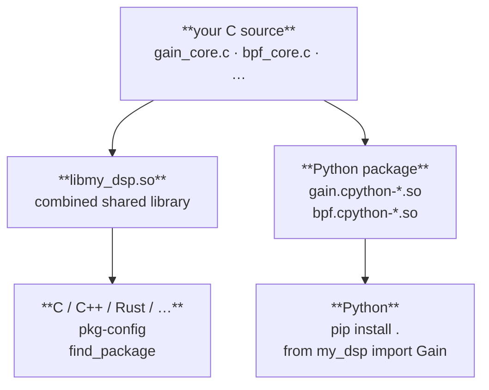

# Workflow

`just-makeit` manages the full lifecycle of a C extension project — from first
scaffold to published package.  Every project it generates is **two things at
once**: a first-class C shared library and a Python package, built from the
same source with no duplication.

______________________________________________________________________

## Creating a project

```sh
just-makeit new my_dsp --component gain --state gain:double:1.0
cd my_dsp
```

`new` scaffolds the project and seeds it with a first component.  The
`--component` flag is optional — omit it and `init` the first component
separately.  `--state` works the same as everywhere else:
`name:type[:default]`.

______________________________________________________________________

## Project layout

```text
my_dsp/
├── CMakeLists.txt
├── Makefile
├── just-makeit.toml
├── pyproject.toml
├── native/
│   ├── inc/
│   │   ├── clib_common.h               # common C99 types
│   │   ├── pyex_common.h               # Python extension includes
│   │   └── gain/
│   │       └── gain_core.h             # component API
│   ├── src/
│   │   └── gain/
│   │       ├── CMakeLists.txt          # component build target
│   │       ├── gain_core.c             # core logic — your algorithm goes here
│   │       └── gain_ext.c              # thin Python binding
│   └── tests/
│       └── test_gain_core.c            # CTest lifecycle test
└── src/
    └── my_dsp/
        ├── __init__.py
        ├── gain.pyi                    # type stub
        └── tests/
            ├── __init__.py
            └── test_gain.py            # pytest
```

______________________________________________________________________

## Building

```sh
make        # cmake configure + build (Release)
make test   # CTest + pytest
```

Produces:

| Artifact                     | Location                       |
| ---------------------------- | ------------------------------ |
| Python DSO (dev, no install) | `src/my_dsp/gain.cpython-*.so` |

The Python DSO lands directly in `src/my_dsp/` so `import my_dsp` works
from the source tree after a single `make` — no install step needed during
development.

______________________________________________________________________

## Implementing your core logic

Open `native/src/gain/gain_core.c`.  The generated stub is a pass-through
— replace `gain_step` with your algorithm:

```c
static inline float complex
gain_step(const gain_state_t *state, float complex x)
{
    return x * (float)state->gain;   /* <— your algorithm here */
}
```

`native/inc/gain/gain_core.h` defines the full lifecycle API:

```c
gain_state_t *gain_create(double gain);
void          gain_destroy(gain_state_t *state);
void          gain_reset(gain_state_t *state);

float complex gain_step(const gain_state_t *state, float complex x);
void          gain_steps(gain_state_t *state,
                         const float complex *in,
                         float complex       *out,
                         size_t               n);

double        gain_get_gain(const gain_state_t *state);
void          gain_set_gain(gain_state_t *state, double gain);
```

The Python binding in `gain_ext.c` is generated and complete — you do not
edit it.  Add your core logic to `gain_core.c` only.

______________________________________________________________________

## Adding a second component

```sh
just-makeit init bpf \
    --state center_freq:double:1000.0 \
    --state bandwidth:double:200.0    \
    --state order:int:4
```

This adds `native/src/bpf/` with the same structure as `gain/`, updates
the top-level `CMakeLists.txt` with `add_subdirectory`, registers the
component in `just-makeit.toml`, and adds `bpf.pyi` and `test_bpf.py` to
the Python package.

`make` picks up the new component automatically.

______________________________________________________________________

## Extending a component's state

```sh
just-makeit add --component gain --state drive:double:1.0
```

Regenerates the six state-sensitive files for `gain` from the updated state
list — all existing files are backed up first and restored if anything fails.
`just-makeit.toml` is updated only after the files are written successfully.

When the project has a single component, `--component` may be omitted.

______________________________________________________________________

## Python integration

### Development (no install)

`make` places the DSOs directly in `src/my_dsp/`. Run Python from the project
root and the src-layout is picked up automatically:

```python
from my_dsp import Gain, BPF
```

### Install from source

```sh
pip install .
```

Uses [just-buildit](https://github.com/just-buildit/just-buildit) as the
PEP 517 build backend.  just-buildit drives the CMake build and packages the
resulting DSOs into a wheel — it works with any C extension project and does
not require just-makeit.

### Usage

```python
from my_dsp import Gain, BPF
import numpy as np

g = Gain(gain=1.0)
f = BPF(center_freq=1000.0, bandwidth=200.0, order=4)

x = np.ones(1024, dtype=np.complex64)
y = g.steps(f.steps(x))
```

______________________________________________________________________

## Packaging and release

```sh
just-makeit build          # CMake build + wheel → dist/
pip install dist/*.whl     # install the wheel
```

Or build manually:

```sh
pip wheel . -w dist/
```

The wheel contains the Python package (`src/my_dsp/`) with the compiled DSOs.

______________________________________________________________________

## Configuration

```sh
just-makeit config                  # show project + component registry
just-makeit config version 0.2.0    # update version
```

`just-makeit.toml` is the source of truth.  `add` and `init` update it
atomically — if generation fails, the config is left unchanged.

______________________________________________________________________

## Future: C library distribution (v0.4)

> **Planned for v0.4.** The features below are not yet generated.

v0.4 will make just-makeit projects first-class C libraries too — distributable
to C, C++, and Rust via standard mechanisms.



Each component's core logic will compile once (as an OBJECT library) and link
into both artifacts — no duplicated object files, no diverging codebases.

New generated files will include:

```text
my_dsp/
├── cmake/
│   ├── my-dsp.pc.in                  # pkg-config template
│   └── my-dsp-config.cmake.in        # CMake find_package template
└── native/
    └── inc/
        └── my_dsp.h                  # umbrella — includes all component headers
```

**Install:**

```sh
cmake --install build --prefix /usr/local
gcc $(pkg-config --cflags --libs my-dsp) main.c -o main
```

```cmake
find_package(my-dsp REQUIRED)
target_link_libraries(my_app PRIVATE my_dsp::my_dsp)
```

______________________________________________________________________

## Pure (stateless / caller-managed) components

`--pure` generates a component where the caller supplies parameters per call
or manages the working-state struct directly, instead of the library owning
an opaque pointer.

```sh
just-makeit init normalize --pure --param scale:double:1.0   # scalar: fn(x, scale)
just-makeit init fir       --pure --param taps:"float[64]"   # struct: caller owns params_t
```

See [Stateful vs pure components](pure.md) for the full cost/benefit analysis
and a decision guide.

______________________________________________________________________

## Performance optimization

Once your algorithm is working, opt into performance annotations at any time:

```sh
just-makeit perf
```

This upgrades the project in-place — writes `native/inc/jm_perf.h`, patches
`step()` with `JM_FORCEINLINE JM_HOT`, and records the setting in
`just-makeit.toml` so future `init` and `add` commands inherit it.  Your
implementation is never touched.

For SIMD acceleration, `jm_perf.h` also ships `JM_DEFINE_STEPS` — a macro
that stamps out `<component>_steps()` from three separated concerns (algorithm
length, SIMD batch width, scratch-buffer chunk size).  You write `step()` and
optionally `step_batch()`; the macro generates the outer dispatch loop.

See [Performance annotations](perf.md) for the full reference.

______________________________________________________________________

See the [Roadmap](roadmap.md) for the full plan.
