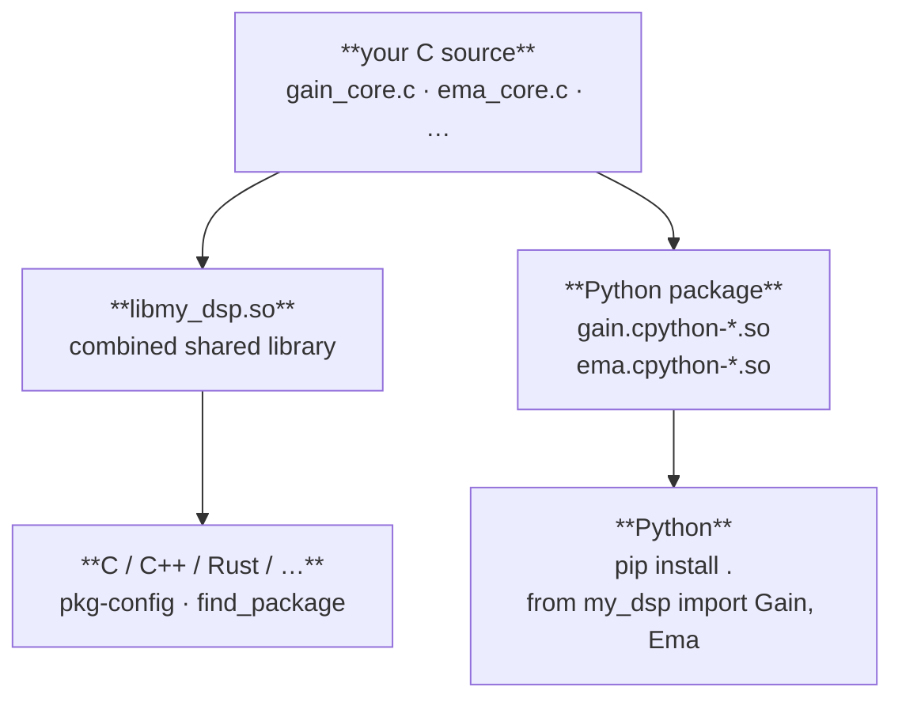

# Workflow

Three common starting points are covered below.  Reference sections follow.

______________________________________________________________________

## Scenario 1 — Simple standalone extension

A single C component exposed as a Python extension.  Good starting point for
wrapping an algorithm, DSP primitive, or performance-critical inner loop.

### 1. Scaffold

```sh
just-makeit new my_dsp \
    --component gain \
    --arg-type float \
    --return-type float \
    --state gain:float:1.0
cd my_dsp
```

`--arg-type` and `--return-type` set the C types for `step()`'s input and
output.  Omit both and they default to `float _Complex`.

### 2. Implement

Open `native/inc/gain/gain_core.h` and fill in the `gain_step` stub:

```c
static inline float
gain_step(const gain_state_t *state, float x)
{
    return state->gain * x;
}
```

`gain_steps()` — the block processor — is already in `gain_core.c` and loops
over this automatically.  You do not edit the Python binding (`gain_ext.c`).

### 3. Build and test

```sh
make        # cmake configure + build (Release)
make test   # CTest (C lifecycle) + pytest (Python API)
```

The `.so` lands in `src/my_dsp/` so `import my_dsp` works immediately from
the project root — no install step needed during development.

### 4. Use from Python

```python
import sys
sys.path.insert(0, "src")   # not needed after pip install

import numpy as np
from my_dsp import Gain

g = Gain(gain=2.0)

# single sample
y = g.step(1.0)              # → 2.0

# block
x = np.ones(1024, dtype=np.float32)
y = g.steps(x)               # → float32 ndarray, all 2.0

# getters / setters
g.set_gain(0.5)
g.get_gain()                 # → 0.5

# reset to declared defaults
g.reset()

# context manager
with Gain(gain=2.0) as g:
    y = g.steps(x)
```

### 5. Install

```sh
pip install .          # build wheel + install
pip install -e .       # editable install (Python-only edits take effect immediately)
```

### 6. Optional: performance annotations

Once the algorithm is working and tested:

```sh
just-makeit perf
make
```

Patches `step()` with `JM_FORCEINLINE JM_HOT`, writes `jm_perf.h` and
`jm_simd.h`, and records the setting so future `init` and `add` calls
inherit it.  See [Performance annotations](perf.md) for the full reference.

______________________________________________________________________

## Scenario 2 — Python package with multiple extensions

Multiple C components in one project, all accessible from a single Python
package.

### 1. Scaffold the first component

```sh
just-makeit new dsp_toolkit \
    --component gain \
    --arg-type float \
    --return-type float \
    --state gain:float:1.0
cd dsp_toolkit && make
```

### 2. Add a second component

```sh
just-makeit init ema \
    --arg-type float \
    --return-type float \
    --state alpha:double:0.1 \
    --state prev:float:0.0
```

`init` writes all C and Python files for the new component and updates:

- root `CMakeLists.txt` — `add_subdirectory` + `target_sources($<TARGET_OBJECTS:…>)`
- umbrella header `native/inc/dsp_toolkit.h` — `#include "ema/ema_core.h"`
- `src/dsp_toolkit/__init__.py` — splices in `from .ema import Ema` and
  adds `"Ema"` to `__all__`, preserving any existing user edits

After `init`, `__init__.py` looks like:

```python
"""dsp_toolkit — Gain component."""

from .gain import Gain
from .ema import Ema

__all__ = ["Gain", "Ema"]
```

No manual edits required.

### 3. Implement both components

`gain_step` (read-only state):

```c
static inline float
gain_step(const gain_state_t *state, float x)
{
    return state->gain * x;
}
```

`ema_step` (writes back to state — drop `const`):

```c
static inline float
ema_step(ema_state_t *state, float x)
{
    float y = (float)state->alpha * x
            + (float)(1.0 - state->alpha) * state->prev;
    state->prev = y;
    return y;
}
```

### 4. Build and test

```sh
make && make test
```

CTest runs `test_gain_core` and `test_ema_core`.  pytest runs the full
generated suite for both components.

### 5. Use from Python

```python
import sys
sys.path.insert(0, "src")

import numpy as np
from dsp_toolkit import Gain, Ema

signal = np.ones(20, dtype=np.float32)

gain = Gain(gain=2.0)
ema  = Ema(alpha=0.3)

for x in signal:
    y = ema.step(gain.step(x))
```

### 6. Add more components

```sh
just-makeit init dc_block --state r:double:0.995
```

Each `init` repeats the same pattern: new C files, updated CMake, updated
`__init__.py`.  `make` picks up the new component automatically.

### 7. Install

```sh
pip install .
```

The wheel bundles all compiled DSOs (`gain.cpython-*.so`, `ema.cpython-*.so`,
…) alongside the Python package.

______________________________________________________________________

## Scenario 3 — Grouped types in a single subpackage module

Use this when you want multiple related Python types to share one `.so` and
import from a common subpackage path (`from my_filters.filter import Fir, Biquad`).

Each type still has its own independent C library; the module is the Python
grouping unit only.

### 1. Scaffold the project and module together

```sh
just-makeit new my_filters --module filter
cd my_filters
```

`--module` is repeatable — `--module osc --module env` scaffolds two modules
in one command.  Each module is an empty slot; types are added with
`just-makeit object`.

Alternatively, scaffold the project first and add the module separately:

```sh
just-makeit new my_filters
cd my_filters
just-makeit module filter
```

### 3. Add types

```sh
just-makeit object fir \
    --module filter \
    --state "coeffs:float[16]" \
    --state "delay:float _Complex[16]" \
    --state "gain:float:1.0"

just-makeit object biquad \
    --module filter \
    --arg-type float \
    --return-type float \
    --state "b0:double:1.0" \
    --state "b1:double:0.0" \
    --state "b2:double:0.0" \
    --state "a1:double:0.0" \
    --state "a2:double:0.0" \
    --state "w1:double:0.0" \
    --state "w2:double:0.0"
```

Each `just-makeit object` call:
- Creates the C library (`_core.h`, `_core.c`, C test, C benchmark)
- Fully regenerates the module's `filter_ext.c`, `CMakeLists.txt`, and `__init__.py`

After both objects:

```python
# src/my_filters/filter/__init__.py — generated
from .filter import Fir, Biquad

__all__ = ["Fir", "Biquad"]
```

Types within a module may have different `--arg-type`/`--return-type`.  Here
`Fir` processes `float complex` and `Biquad` processes `float`.

### 4. Implement

Edit `native/inc/fir/fir_core.h` and `native/inc/biquad/biquad_core.h` to
fill in the `_step` stubs, exactly as in Scenarios 1 and 2.

### 5. Build and test

```sh
make && make test
```

CMake builds one `.so` (`filter.cpython-*.so`) inside
`src/my_filters/filter/`, linking both `fir_core` and `biquad_core` OBJECT
libraries.  CTest runs `test_fir_core` and `test_biquad_core`.

### 6. Use from Python

```python
import sys
sys.path.insert(0, "src")

import numpy as np
from my_filters.filter import Fir, Biquad

fir = Fir(gain=1.0)
bq  = Biquad(b0=1.0)
```

Both types are fully independent — separate `create`/`destroy` lifecycles,
each with its own `step`, `steps`, `reset`, and context manager support.

### 7. Add a third type later

```sh
just-makeit object iir --module filter --state "gain:float:1.0"
```

`filter_ext.c`, `CMakeLists.txt`, and `__init__.py` are all regenerated from
the complete object list.  `Fir` and `Biquad` are unaffected.

### 8. Install

```sh
pip install .
```

The wheel contains one `.so` for the `filter` subpackage rather than one `.so`
per type.

### Module vs init — when to use which

| `just-makeit init` | `just-makeit module` + `just-makeit object` |
|---|---|
| Each type gets its own `.so` | All types share one `.so` subpackage |
| `from my_pkg import Gain, Ema` | `from my_pkg.filter import Fir, Biquad` |
| Good for unrelated algorithms | Good for a cohesive type family |
| Simpler; each type is independent at the `.so` level | One import namespace for the group |

Both workflows produce a `lib<project>.so` C library that supports
`cmake --install`, pkg-config, and CMake `find_package`.

______________________________________________________________________

## Project layout (full)

After scaffolding with one component and running `just-makeit perf`:

```text
my_dsp/
├── CMakeLists.txt
├── Makefile
├── just-makeit.toml
├── pyproject.toml
├── cmake/
│   └── my-dsp.pc.in                    # pkg-config template
├── native/
│   ├── benchmarks/
│   │   └── bench_gain_core.c           # C benchmark
│   ├── inc/
│   │   ├── clib_common.h               # common C99 types
│   │   ├── pyex_common.h               # Python extension includes
│   │   ├── my_dsp.h                    # umbrella header
│   │   ├── jm_perf.h                   # JM_FORCEINLINE / JM_HOT / JM_UNROLL …
│   │   ├── jm_simd.h                   # width-portable SIMD macros
│   │   └── gain/
│   │       └── gain_core.h             # component API  ← implement step() here
│   ├── src/
│   │   └── gain/
│   │       ├── CMakeLists.txt
│   │       ├── gain_core.c             # steps() loop + any multi-sample logic
│   │       └── gain_ext.c              # Python binding  ← do not edit
│   └── tests/
│       └── test_gain_core.c            # CTest lifecycle test
└── src/
    └── my_dsp/
        ├── __init__.py
        ├── gain.pyi                    # type stub
        ├── benchmarks/
        │   ├── __init__.py
        │   └── bench_gain.py           # pytest-benchmark suite
        └── tests/
            ├── __init__.py
            └── test_gain.py            # pytest
```

______________________________________________________________________

## Extending a component's state

```sh
just-makeit add --component gain --state drive:double:1.0
```

Regenerates the six state-sensitive files for `gain` from the updated state
list.  `just-makeit.toml` is updated only after the files are written
successfully.  When the project has a single component, `--component` may be
omitted.

______________________________________________________________________

## Benchmarking

```sh
make bench              # C benchmark (timing loop) + Python pytest-benchmark
make bench-save         # save baseline tagged with current git describe
make bench-compare      # compare against last saved baseline
```

The C benchmark in `native/benchmarks/bench_gain_core.c` runs a raw timing
loop with no pytest overhead — useful for measuring SIMD uplift.

______________________________________________________________________

## C library distribution

Every just-makeit project is also a first-class C library.



Each component's core logic compiles once (CMake OBJECT library) and links
into both artifacts.

```sh
cmake -S . -B build -DCMAKE_INSTALL_PREFIX=/usr/local
cmake --install build
gcc $(pkg-config --cflags my-dsp) main.c $(pkg-config --libs my-dsp) -lm -o main
```

> **Linux linker note:** `--cflags` and `--libs` must be split with the
> source file between them.  GNU ld uses `--as-needed` by default on
> Debian/Ubuntu, which silently drops any shared library that appears
> before the object files that reference it.  Putting `-lmy_dsp` after
> `main.c` ensures the linker sees the undefined symbols first.

```cmake
find_package(my_dsp REQUIRED)
target_link_libraries(my_app PRIVATE my_dsp::my_dsp_lib m)
```

See [Installing your C library for end users](c-library.md) for the full
guide: prerequisites, custom prefixes, rpath, and verification.

______________________________________________________________________

## Configuration

```sh
just-makeit config                  # show project + component registry
just-makeit config version 0.2.0    # update version
```

`just-makeit.toml` is the source of truth for all scaffolded state.

______________________________________________________________________

## Pure (stateless) components

```sh
just-makeit init normalize --pure --param scale:double:1.0
```

See [Stateful vs pure components](pure.md) for the decision guide.

______________________________________________________________________

See the [Roadmap](roadmap.md) for the full plan.
