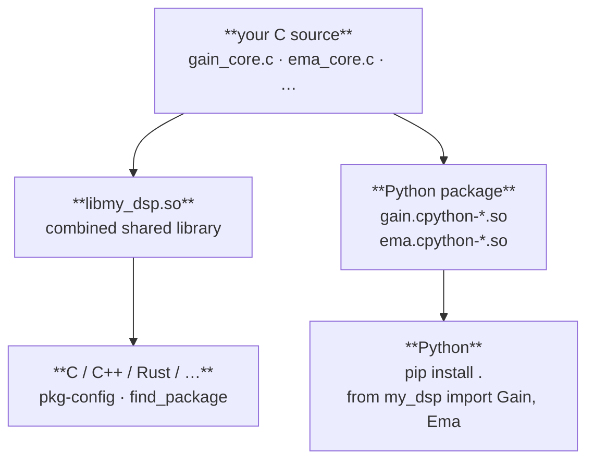

# Distribution & configuration

## C library distribution

Every just-makeit project is also a first-class C library.



Each object's core logic compiles once (CMake OBJECT library) and links
into both artifacts.

```sh
cmake -S . -B build -DCMAKE_INSTALL_PREFIX=/usr/local
cmake --install build
gcc $(pkg-config --cflags my-dsp) main.c $(pkg-config --libs my-dsp) -lm -o main
```

> **Linux linker note:** `--cflags` and `--libs` must be split with the
> source file between them. GNU ld uses `--as-needed` by default on
> Debian/Ubuntu, which silently drops any shared library that appears
> before the object files that reference it. Putting `-lmy_dsp` after
> `main.c` ensures the linker sees the undefined symbols first.

```cmake
find_package(my_dsp REQUIRED)
target_link_libraries(my_app PRIVATE my_dsp::my_dsp_lib m)
```

See [Installing your C library for end users](../c-library.md) for the full
guide: prerequisites, custom prefixes, rpath, and verification.

______________________________________________________________________

## Configuration

```sh
just-makeit config                  # show project + object registry
just-makeit config version 0.2.0    # update version
```

`just-makeit.toml` is the source of truth for all scaffolded state.

______________________________________________________________________

See the [Roadmap](../roadmap.md) for the full plan.
