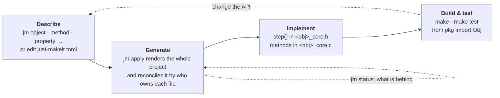

# Workflows

just-makeit generates the C, the Python bindings, the build system, and the
tests — you write the algorithm. These pages walk the common paths end to end.

Every path is the same loop:

- **Describe** — [Configuration](../configuration.md) and the
    [CLI reference](../commands/scaffold.md); which verb to reach for is the
    [decision tree](../decision-tree.md).
- **Generate** — who owns each file, and so what `apply` does to it:
    [the edit lifecycle](edit-lifecycle.md#who-owns-each-file); every file,
    tagged: [project layout](layout-and-api.md#project-layout-full).
- **Implement** — [template gallery](../templates/index.md) for the shape of
    an object; [enriching stubs](enriching-stubs.md) for docstrings from your
    header.
- **Build & test** — [testing & benchmarking](testing.md),
    [distribution](distribution.md); keeping a project current as jm moves:
    [upgrading](../upgrading.md).

## Pick your starting point

| You're here if…                                                                                      | Start with                            |
| ---------------------------------------------------------------------------------------------------- | ------------------------------------- |
| You have **one algorithm** to wrap and want `from my_dsp import Engine` with full C and Python tests | [Standalone extension](standalone.md) |
| You have **several independent algorithms** and want them in one package, each with its own `.so`    | [Multi-extension package](package.md) |
| You want **related types grouped** behind one import — `from my_filters.filter import Fir, Biquad`   | [Grouped module types](module.md)     |

Not sure whether an object should be standalone or live in a module? See
[standalone vs module](module.md#standalone-object-vs-module-object-when-to-use-which).

## Working with a project

- [The edit lifecycle](edit-lifecycle.md) — author → apply/regenerate →
    implement → test → iterate, plus lifting an existing C body with `--impl`.
- [Project layout & generated API](layout-and-api.md) — what jm writes, and the
    C and Python API it exposes.

## Documentation & tests

- [Type stubs & doctests](type-stubs.md) — the generated `.pyi` and its
    out-of-the-box doctests.
- [Enriching stubs from your C header](enriching-stubs.md) — drive **rich
    docstrings and runnable doctests** straight from your header's Doxygen.
- [Testing & benchmarking](testing.md) — the generated test and benchmark
    suites, and extending an object's state.

## Shipping

- [Distribution & configuration](distribution.md) — install the C library for
    downstream consumers, and the `just-makeit.toml` reference.
